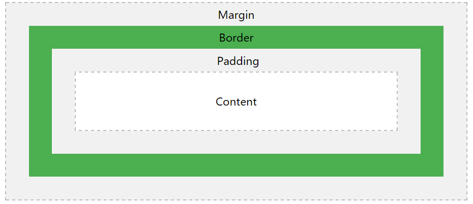

[TOC]

# CSS 简介
CSS stands for Cascading Style Sheets
CSS1已被废弃，CSS2.1是推荐标准，CSS3分成了众多小模块，其标准正在逐步制定。
第一版CSS标准发布于1996年。

## 基本语法


## 基本选择器
* 标签选择器：`p { text-align: center; color: red; }`
* id选择器：`#para1 { text-align: center; color: red; }`
* 类选择器：`.center { text-align: center; color: red; }`
* 分组选择器：`h1, h2, p {text-align: center; color: red;}`

## CSS注释
```css
p {
    color: red;
    /* This is a single-line comment */
    text-align: center;
}

/* This is
a multi-line
comment */
```

## 基本颜色
网页中颜色最基本的有三种表示方法：颜色英文名、RGB值、HEX值。

| Color | Name  | RGB          | HEX     |
| ----- | ----- | ------------ | ------- |
| 红色    | red   | rgb(255,0,0) | #FF0000 |
| 绿色    | green | rgb(0,255,0) | #00FF00 |
| 蓝色    | blue  | rgb(0,0,255) | #0000FF |


# CSS 连接方式
有三种方式可以把CSS连接到指定HTML中以使用。
* External style sheet
* Internal style sheet
* Inline style

## 外部样式表
需要两个文件一个`my.html`，一个`my.css`
```html
<!-- my.html -->
<head>
<link rel="stylesheet" type="text/css" href="my.css">
</head>
```
```css
/* my.css */
body {
    background-color: lightblue;
}

h1 {
    color: navy;
    margin-left: 20px;
}
```

## 内部样式表
```html
<!DOCTYPE html>
<html>
<head>
<style>
body {
    background-color: linen;
}
h1 {
    color: maroon;
    margin-left: 40px;
} 
</style>
</head>
<body>

<h1>This is a heading</h1>
<p>This is a paragraph.</p>

</body>
</html>
```

## 行内样式表
`<h1 style="color:blue;margin-left:30px;">This is a heading</h1>`

## 样式表优先级
行内样式表具有最高优先级。
外部样式表和内部样式表，按照谁在后谁优先级高的原则。
```
<head>
<link rel="stylesheet" type="text/css" href="my1.css">
<link rel="stylesheet" type="text/css" href="my2.css">
<!-- my2.css优先级高 -->
</head>

<head>
<link rel="stylesheet" type="text/css" href="my1.css">
<style> h1 {color: red;} </style>
<!-- 内部样式表优先级高 -->
</head>

<head>
<style> h1 {color: red;} </style>
<link rel="stylesheet" type="text/css" href="my1.css">
<!-- 外部样式表优先级高 -->
</head>
```
# CSS 背景
CSS background properties：
* background-color - Sets the background color of an element
* background-image - Sets the background image for an element
* background-repeat - Sets how a background image will be repeated
* background-attachment - Sets whether a background image is fixed or scrolls with the rest of the page
* background-position - Sets the starting position of a background image

## 背景颜色
` body {background-color: lightblue;} `

## 背景图片
` body {background-image: url("paper.gif");} `
默认情况下，背景图片会水平垂直重复。
水平重复：`background-repeat: repeat-x;`
垂直重复：`background-repeat: repeat-y;`
不重复： `background-repeat: no-repeat;`

## 背景位置
`background-position: right top;`
固定位置，不随滚动条的滚动而滚动`background-attachment: fixed;`

## 背景设置简写
```css
body {
    background: #ffffff url("img_tree.png") no-repeat right top;
}
```
简写的顺序可以按照下面这样：
* background-color
* background-image
* background-repeat
* background-attachment
* background-position

# CSS 边框
简单示例如下：
` p {border: 5px solid red;} `

## 边框样式
边框的样式必须设置，否则边框无效。常用的边框样式有如下几种：
* dotted - 点状边框
* dashed - 虚线边框
* solid -  实线边框
* double - 双实线边框

Example：
` border-style: dashed; `
边框的样式也可以分别设置：
```css
border-top-style: dashed;
border-right-style: solid;
border-bottom-style: double;
border-left-style: dotted;
```
边框样式设置的简写方式，遵循上右下左的顺序。
` border-style: dotted dashed solid double; `

## 边框宽度
` border-width: 5px; `，这种写法4个边框宽度都为5px
单独设置边框宽度：
```css
border-top-width: 5px;
border-right-width: 10px;
border-bottom-width: 15px;
border-left-width: 20px;
```

## 边框颜色
` border-color: red; `，这种写法4个边框的颜色都为红色。
单独设置边框的颜色：
```css
border-top-color: black;
border-right-color: red;
border-bottom-color: blue;
border-left-color: green;
```

## 圆角边框
IE8及其以下不支持此属性。
` border-radius: 5px; `
利用圆角边框可以使一个盒子呈现**圆形**
```css
p {
	width: 200px;	
	height: 200px;	
	background-color: red;
	border-radius: 100px;
}
```

## 样式简写生效顺序
这里以`border-color`样式设置为例，其余的类推。
`border-color`简写有4种情况：
1. `border-color: black red blue green;`，分别对应**上右下左**边框的颜色。
2. `border-color: black red blue;`，分别对应**上右下**边框的颜色，**左**边框的颜色和右边框一样为**红色**。
3. `border-color: black red;`，**上下**为黑色，**左右**为红色。
4. `border-color: black;`，所有边框均为黑色。

# CSS 外边距
` p {margin: 5px;} `
盒子与盒子之间的距离称为**外边距**，margin的值可以是**auto**，还可以设置为**负数**。

## 单独设置外边距
```css
p {
    margin-top: 100px;
    margin-bottom: 100px;
    margin-right: 150px;
    margin-left: 80px;
}
```
外边距的简写设置，参考本笔记**样式简写生效顺序**。

## 利用auto实现水平居中
```css
<!DOCTYPE html>
<html>
<head>
<style>
div {
    width: 400px;
    /* height: 400px;   宽度需不需要给呢？待定... */
    margin: auto; /* 也可以 margin: 0 auto; */
    border: 2px solid green;
}
</style>
</head>
<body>
<div>
This div will be centered because it has margin: auto;
</div>
</body>
</html>
```

## 外边距塌陷
上下外边距有时会发生塌陷的情况，即两个盒子之间的外边距不等于它们外边距之和，而等于它们之间最大的外边距。
左右外边距不会发生塌陷，只有上下外边距会发生塌陷的情况。
Example
```css
<!DOCTYPE html>
<html>
<head>
<meta charset="utf-8">
<style>
h1 {
    margin-bottom: 50px;
	outline: 1px dashed red;
}

h2 {
    margin-top: 20px;
	outline: 1px dashed green;
}
</style>
</head>
<body>

<h1>Heading 1</h1>
<h2>Heading 2</h2>

<p>h1与h2之间的外边距不等于(20+50)px，而是等于50px</p>

</body>
</html>
```

# CSS 内边距
` div {padding: 10px;} `
内边距定义了内容与边框之间的距离。
注意：padding**不可以**设置为负值。
可以分别指定4个方向的边距：
```css
p {
    padding-top: 50px;
    padding-right: 30px;
    padding-bottom: 50px;
    padding-left: 80px;
}
```
内边距的简写设置，参考本笔记**样式简写生效顺序**。

# CSS 宽高
```css
div {
    height: 100px;
    width: 500px;
    background-color: powderblue;
}
```
元素的宽高可以设置为像素、百分比等。
**注意**：元素的宽高为**内容**的宽高，不包括外边距、边框、内边距。

## 最大宽与最小宽
* max-height - Sets the maximum height of an element
* min-height - Sets the minimum height of an element
* max-width - Sets the maximum width of an element
* min-width - Sets the minimum width of an element

# CSS 盒子模型
CSS的盒子模型包括4个部分：外边距、边框、内边距、内容。其关系如下图所示：

在通过`width`和`height`属性设置一个盒子的宽高时，仅仅时设置了内容部分的宽高，而一个盒子**真正**的宽高，是盒子模型4个部分宽高的相加。
Example：
```css
div {
    width: 320px;
    padding: 10px;
    border: 5px solid gray;
    margin: 0; 
}
```
上面的代码，计算div的总宽度应为：

```
320px(width)  
+ 20px(left + right padding)
+ 10px(left + right border) 
+ 0px(left + right margin) 
= 350px
```

# CSS 轮廓
`outline: 1px dashed solid;`
CSS `outline` 属性定义了盒子的轮廓，其用法与`border`属性几乎一致。
但与`border`不同，`outline`不属于盒子的一部分，其不影响盒子的真实宽高。
我自己经常把`outline`用来布局界面的时候，显示轮廓用。

# CSS 文本
## 文本颜色
`body {color: blue}`
建议再定义文本颜色的同时，也定义背景颜色。依赖浏览器默认设置有时不够稳妥。

## 水平对齐
`text-align`定义了文本的水平对齐方式，有4种对齐方式，如下：
```css
h1 { text-align: center; }
h2 { text-align: left; }
h3 { text-align: right; }
h4 { text-align: justify; } /* 两端对齐 */
```

## 垂直对齐
语法：`vertical-align: baseline|length|sub|super|top|text-top|middle|bottom|text-bottom|initial|inherit;`


## 文本装饰
用法大致有以下几种：
```css
a { text-decoration: none; } /* 去掉超链接的下划线 */
h1 { text-decoration: overline; } /* 为h1标题添加上划线 */
h2 { text-decoration: line-through; } /* 为h2标题添加中划线 */
h3 { text-decoration: underline; } /* 为h3标题添加下划线 */
```

## 文本转换
`text-transform`对文本进行大小写转换。
```css
p.uppercase { text-transform: uppercase; } /* 转为大写 */
p.lowercase { text-transform: lowercase; } /* 转为小写 */
p.capitalize { text-transform: capitalize; } /* 首字母大写 */
```

## 文本缩进
`p { text-indent: 50px; } /* 缩进50px */ `

## 字符间距
```css
h1 { letter-spacing: 3px; } /* 字符间距增加3px */
h2 { letter-spacing: -3px; } /* 字符间距减少3px */
```

## 行高
`p { line-height: 20px; }`

## 单词间距
```html
<!DOCTYPE html>
<html>
<head>
<meta charset="utf-8">
<style>
h1 { word-spacing: 10px; } /* 单词间距增加10px */
h2 { word-spacing: -5px; } /* 单词间距减少5px */
</style>
</head>
<body>
<h1>hello world css</h1>
<h2>hello world css2</h2>
</body>
</html>
```

## 文本阴影
IE9及以下不支持`text-shadow`。
语法：
`text-shadow: h-shadow v-shadow blur-radius color;`
Example：
`h1 { text-shadow: 2px 2px 8px #FF0000; }`

## 文本溢出
`text-overflow`设置了当文本超出盒子边界时该做什么处理。
语法：
`text-overflow: clip|ellipsis|string|initial|inherit;`
语法解释：
* clip - 默认值，多余部分裁剪掉。
* ellipsis - 多余部分用省略号（...）替代。

## white-space
没找到好的翻译，直接用英文原名。
whitespace意思为空白、空格。
`white-space`规定元素中的空白（空格）怎样去处理。
语法：
`white-space: normal|nowrap|pre|pre-line|pre-wrap|initial|inherit;`
语法解释：
normal - 默认值。多余的空格会被合并成一个空格，文本会在必要的时候自动换行。
nowrap - 多余的空格会被合并成一个空格，但是文本不会自动换行。
下面的代码演示了`nowrap`的效果：
```html
<!DOCTYPE html>
<html>
<head>
<meta charset="utf-8"> 
<style>
p { white-space:nowrap; }
</style>
</head>
<body>

<p>
我就是这么执着。我坚决不换行。再长也不换。
我就是这么执着。我坚决不换行。再长也不换。
我就是这么执着。我坚决不换行。再长也不换。
我就是这么执着。我坚决不换行。再长也不换。
我就是这么执着。我坚决不换行。再长也不换。
</p>

</body>
</html>
```

# CSS 字体
## 字体常识
字体在大的方向可以分为三种：
衬线字体（Serif）、无衬线字体（Sans-serif）、等宽字体（Monospace）。

## Font Family
` p { font-family: "Times New Roman", "微软雅黑", Times, serif; } `
字体中间有空格的要用引号隔开，字体设置有多个，则后面的为备选字体，第一个字体不支持，就换第二个字体，以此类推。

## Font Style
```css
p.normal { font-style: normal; } /* 默认的正常字体 */
p.italic { font-style: italic; } /* 倾斜字体 */
```

## Font Size
`p {font-size: 14px;}`

## Font Weight
```css
p.normal { font-weight: normal; } /* 正常字体 */ 
p.thick { font-weight: bold; } /* 加粗字体 */
```

# CSS 链接
## 链接的样式
链接可以应用很多样式，比如字体、字体颜色、背景颜色等。
一般来说链接有**4种**状态，分别是：
* `a:link` - 正常状态
* `a:visited` - 已被访问过的状态
* `a:hover` - 鼠标hover上去的状态
* `a:active` - 鼠标点击的瞬间活动状态
```css
/* unvisited link */
a:link {color: red; }

/* visited link */
a:visited {color: green;}

/* mouse over link */
a:hover {color: hotpink;}

/* selected link */
a:active {color: blue;}
```
在分别设置链接4种样式的时候，注意遵循上面的**顺序**，比较稳妥。

## Text Decoration
`text-decoration`主要是用来移除链接默认的下划线样式。
```css
a:visited {text-decoration: none;}
a:hover {text-decoration: underline;}
```

## Background Color
设置链接的背景颜色。
```css
a:link { background-color: yellow; }
a:visited { background-color: cyan; }
a:hover { background-color: lightgreen; }
a:active { background-color: hotpink; } 
```

## 按钮链接
下面的代码演示了一个高级技巧，使链接看起来，像按钮。
```css
<!DOCTYPE html>
<html>
<head>
<style>
a:link, a:visited {
    background-color: #fff;
    color: black;
    padding: 14px 25px;
    text-align: center;
    text-decoration: none;
    display: inline-block;
    border: 1px solid green;
}


a:hover, a:active {
    background-color: #999;
}
</style>
</head>
<body>

<a href="javascript:;" target="_blank">This is a link</a>

</body>
</html>
```

# CSS 列表
清除默认样式。
```css
ul {
    list-style-type: none;
    margin: 0;
    padding: 0;
}
```


# CSS 表格
## 合并表格边框
```css
table {
    border-collapse: collapse;
}

table, th, td {
    border: 1px solid black;
}
```

## 单独设置表格下边框
```css
th, td {
    border-bottom: 1px solid #ddd;
}
```

## Hoverable Table
`tr:hover {background-color: #f5f5f5}`

## 隔行换色
使用CSS3`nth-child()`选择器，可以很容易的实现，表格隔行换色的效果。
```html
<!DOCTYPE html>
<html>
<head>
<style>
table {
    border-collapse: collapse;
    width: 100%;
}

th, td {
    text-align: left;
    padding: 8px;
}

tr:nth-child(even){background-color: #f2f2f2}
</style>
</head>
<body>

<h2>Striped Table</h2>
<p>For zebra-striped tables, use the nth-child() selector and add a background-color to all even (or odd) table rows:</p>

<table>
  <tr>
    <th>First Name</th>
    <th>Last Name</th>
    <th>Points</th>
  </tr>
  <tr>
    <td>Peter</td>
    <td>Griffin</td>
    <td>$100</td>
  </tr>
  <tr>
    <td>Lois</td>
    <td>Griffin</td>
    <td>$150</td>
  </tr>
  <tr>
    <td>Joe</td>
    <td>Swanson</td>
    <td>$300</td>
  </tr>
  <tr>
    <td>Cleveland</td>
    <td>Brown</td>
    <td>$250</td>
  </tr>
</table>

</body>
</html>

```

## 一个漂亮的表格
使用CSS修饰表格的综合案例：
```html
<!DOCTYPE html>
<html>
<head>
<style>
#customers {
    font-family: "Trebuchet MS", Arial, Helvetica, sans-serif;
    border-collapse: collapse;
    width: 100%;
}

#customers td, #customers th {
    border: 1px solid #ddd;
    padding: 8px;
}

#customers tr:nth-child(even){background-color: #f2f2f2;}

#customers tr:hover {background-color: #ddd;}

#customers th {
    padding-top: 12px;
    padding-bottom: 12px;
    text-align: left;
    background-color: #4CAF50;
    color: white;
}
</style>
</head>
<body>

<table id="customers">
  <tr>
    <th>Company</th>
    <th>Contact</th>
    <th>Country</th>
  </tr>
  <tr>
    <td>Alfreds Futterkiste</td>
    <td>Maria Anders</td>
    <td>Germany</td>
  </tr>
  <tr>
    <td>Berglunds snabbköp</td>
    <td>Christina Berglund</td>
    <td>Sweden</td>
  </tr>
  <tr>
    <td>Centro comercial Moctezuma</td>
    <td>Francisco Chang</td>
    <td>Mexico</td>
  </tr>
  <tr>
    <td>Ernst Handel</td>
    <td>Roland Mendel</td>
    <td>Austria</td>
  </tr>
  <tr>
    <td>Island Trading</td>
    <td>Helen Bennett</td>
    <td>UK</td>
  </tr>
  <tr>
    <td>Königlich Essen</td>
    <td>Philip Cramer</td>
    <td>Germany</td>
  </tr>
  <tr>
    <td>Laughing Bacchus Winecellars</td>
    <td>Yoshi Tannamuri</td>
    <td>Canada</td>
  </tr>
  <tr>
    <td>Magazzini Alimentari Riuniti</td>
    <td>Giovanni Rovelli</td>
    <td>Italy</td>
  </tr>
  <tr>
    <td>North/South</td>
    <td>Simon Crowther</td>
    <td>UK</td>
  </tr>
  <tr>
    <td>Paris spécialités</td>
    <td>Marie Bertrand</td>
    <td>France</td>
  </tr>
</table>

</body>
</html>

```

# CSS Display
## 块级元素
Examples of block-level elements：
```
<div>
<h1> - <h6>
<p>
<form>
<header>
<footer>
<section>
```
块级元素独占一行，宽度默认为最大宽度（尽可能撑满整个屏幕）。

## 行内元素
Examples of inline elements:
```
<span>
<a>

```
行内元素不会自动换行，其宽度为**内容**的宽度。

## 修改元素显示方式
可以通过设置元素的`display`样式来更改元素的显示方式。
```css
li {display: inline;} /* 行内元素 */
li {display: block;} /* 块级元素 */ 
p {display: none;} /* 隐藏该元素 */
```
更改元素的显示方式，只能影响该元素如何在页面上显示。不能改变元素本身的性质。比如设置了`span {display: block;}`，这个`span`元素其性质仍然是行内元素，不能在其中**嵌套**块级元素。

## Display与Visibility
`display:none;`隐藏该元素，并且移除该元素所占的空间。
`visibility: hidden;`隐藏该元素，但该元素所占的空间仍然保留。
下面的代码配合JavaScipt说明了这个问题。
```html
<!DOCTYPE html>
<html>
<head>
<style>
.imgbox {
    float: left;
    text-align: center;
    width: 120px;
    border: 1px solid gray;
    margin: 4px;
    padding: 6px;
}

button {
    width: 100%;
}
</style>
</head>
<body>

<h3>Difference between display:none and visiblity: hidden</h3>
<p><strong>visibility:hidden</strong> hides the element, but it still takes up space in the layout.</p>
<p><strong>display:none</strong> removes the element from the document. It does not take up any space.</p>

<div class="imgbox" id="imgbox1">Box 1<br>
  
  <button onclick="removeElement()">Remove</button>
</div>
<div class="imgbox" id="imgbox2">Box 2<br>
  
  <button onclick="changeVisibility()">Hide</button>
</div>
<div class="imgbox">Box 3<br>
  
  <button onclick="resetElement()">Reset All</button>
</div>

<script>
function removeElement() {
    document.getElementById("imgbox1").style.display = "none";
}

function changeVisibility() {
    document.getElementById("imgbox2").style.visibility = "hidden";
}

function resetElement() {
    document.getElementById("imgbox1").style.display = "block";
    document.getElementById("imgbox2").style.visibility = "visible";
}
</script>

</body>
</html>
```

## `inline-block`
不会换行但是可以设置宽高。

# CSS 定位
## The position Property
`position`属性可以设置4种值：
* `static`
* `relative`
* `fixed`
* `absolute`

## `position: static;`
默认值，元素在文档流中正常显示。

## `position: relative;`
相对定位：
```css
div.relative {
    position: relative;
    left: 30px;
    border: 3px solid #73AD21;
}
```

## `position: fixed;`
固定定位，不会随屏幕滚动而滚动。
```css
div.fixed {
    position: fixed;
    bottom: 0;
    right: 0;
    width: 300px;
    border: 3px solid #73AD21;
}
```

## `position: absolute;`
绝对定位，相对于其祖先进行定位，
```css
<!DOCTYPE html>
<html>
<head>
<style>
div.relative {
    position: relative;
    width: 400px;
    height: 200px;
    border: 3px solid #73AD21;
} 

div.absolute {
    position: absolute;
    top: 80px;
    right: 0;
    width: 200px;
    height: 100px;
    border: 3px solid #73AD21;
}
</style>
</head>
<body>

<h2>position: absolute;</h2>

<p>An element with position: absolute; is positioned relative to the nearest positioned ancestor (instead of positioned relative to the viewport, like fixed):</p>

<div class="relative">This div element has position: relative;
  <div class="absolute">This div element has position: absolute;</div>
</div>

</body>
</html>

```

## 重叠元素
默认情况下，如果两个元素重叠，后面的元素会覆盖前面的元素。
可以通过设置`z-index`属性改变重叠显示顺序。
`z-index: 5`，`z-index: -1`。
`z-index`值可正可负，数值越大，显示优先级越高。

# CSS Overflow
CSS`overflow`属性规定了当内容超出其容器的高度时如何处理，其去值如下：
* visible - 默认值。多余的内容不会被裁剪，而是直接显示到盒子的外面。
* hidden - 多余内容被裁剪，不可见。
* scroll - 提供一个滚动条，以供用户阅读多余的内容。
* auto - 自动选择以上之一。
  注意 ：`overflow`只在**定高**的元素中生效。
  注意：`overflow: scrool;`会提供横向和竖向两个方向的滚动条。

## `overflow`用法举例
**Visible**
```css
<!DOCTYPE html>
<html>
<head>
<style>
div {
    background-color: #eee;
    width: 200px;
    height: 50px;
    border: 1px dotted black;
    overflow: visible;
}
</style>
</head>
<body>

<h2>CSS Overflow</h2>
<p>By default, the overflow is visible, meaning that it is not clipped and it renders outside the element's box:</p>

<div>You can use the overflow property when you want to have better control of the layout. The overflow property specifies what happens if content overflows an element's box.</div>

</body>
</html>

```

**Hidden**
```css
<!DOCTYPE html>
<html>
<head>
<style>
div {
    background-color: #eee;
    width: 200px;
    height: 50px;
    border: 1px dotted black;
    overflow: hidden;
}
</style>
</head>
<body>

<h2>CSS Overflow</h2>
<p>With the hidden value, the overflow is clipped, and the rest of the content is hidden:</p>
<p>Try to remove the overflow property to understand how it works.</p>

<div>You can use the overflow property when you want to have better control of the layout. The overflow property specifies what happens if content overflows an element's box.</div>

</body>
</html>

```

**Scroll**
```css
<!DOCTYPE html>
<html>
<head>
<style>
div {
    background-color: #eee;
    width: 200px;
    height: 50px;
    border: 1px dotted black;
    overflow: scroll;
}
</style>
</head>
<body>

<h2>CSS Overflow</h2>
<p>Setting the overflow value to scroll, the overflow is clipped and a scrollbar is added to scroll inside the box. Note that this will add a scrollbar both horizontally and vertically (even if you do not need it):</p>

<div>You can use the overflow property when you want to have better control of the layout. The overflow property specifies what happens if content overflows an element's box.</div>

</body>
</html>

```
## overflow-x and overflow-y
单独定义水平和垂直方向内容超出盒子时怎么处理。
```css
div {
    overflow-x: hidden; /* Hide horizontal scrollbar */
    overflow-y: scroll; /* Add vertical scrollbar */
}
```

# CSS 浮动
定义元素左浮动`float: left;`，定义元素右浮动`float: right;`。

## 清除浮动
```html
<!DOCTYPE html>
<html>
<head>
<style>
.div1 {
    float: left;
    width: 100px;
    height: 50px;
    margin: 10px;
    border: 3px solid #73AD21;
}

.div2 {
    border: 1px solid red;
}


.div3 {
    float: left;
    width: 100px;
    height: 50px;
    margin: 10px;
    border: 3px solid #73AD21;
}

.div4 {
    border: 1px solid red;
    clear: left;
}
</style>
</head>
<body>

<h2>Without clear</h2>
<div class="div1">div1</div>
<div class="div2">div2 - Notice that the div2 element is after div1, in the HTML code. However, since div1 is floated to the left, this happens: the text in div2 is floated around div1, and div2 surrounds the whole thing.</div>

<h2>Using clear</h2>
<div class="div3">div3</div>
<div class="div4">div4 - Using clear moves div4 down below the floated div3. The value "left" clears elements floated to the left. You can also clear "right" and "both".</div>

</body>
</html>

```

## 清除浮动
清除浮动的参考代码：
```css
.clearfix::after {
    content: "";
    clear: both;
    display: table;
}
```

如果一个浮动元素的高，大于其容器的高。那么这个浮动元素将显示到盒子外面。可以通过添加
`.clearfix {overflow: auto;}`来解决这个问题。
```html
<!DOCTYPE html>
<html>
<head>
<style>
div {
    border: 3px solid #73AD21;
}

.img1 {
    float: right;
}

.clearfix {
    overflow: auto;
}

.img2 {
    float: right;
}
</style>
</head>
<body>

<p>In this example, the image is taller than the element containing it, and it is floated, so it overflows outside of its container:</p>

<div>
Lorem ipsum dolor sit amet, consectetur adipiscing elit. Phasellus imperdiet, nulla et dictum interdum...</div>

<p style="clear:right">Add a clearfix class with overflow: auto; to the containing element, to fix this problem:</p>

<div class="clearfix">
Lorem ipsum dolor sit amet, consectetur adipiscing elit. Phasellus imperdiet, nulla et dictum interdum...</div>

</body>
</html>

```

# CSS 居中 （待完成）
这是较大的问题，有多种解决方案。未完待补充！


# CSS 组合选择器
在CSS3中有4种组合选择器可供使用：
* descendant selector (space) 后台选择器
* child selector (>) 孩子选择器
* adjacent sibling selector (+) 
* general sibling selector (~)

## 孩子元素和孙子元素
直接嵌套的属于孩子元素，嵌套两层以上的属于孙子元素。
```
<div id="parent-div">
	<p id="p1">我是parent-div的孩子元素</p>
	<p id="p2">我是parent-div的孩子元素</p>
	<div><p id="p3"></p>我是parent-div的孙子元素</div>
</div>
```

## 后代选择器
```html
<!DOCTYPE html>
<html>
<head>
<style>
div p {
    background-color: yellow;
}
</style>
</head>
<body>

<div>
  <p>Paragraph 1 in the div.</p>
  <p>Paragraph 2 in the div.</p>
  <span><p>Paragraph 3 in the div.</p></span>
</div>

<p>Paragraph 4. Not in a div.</p>
<p>Paragraph 5. Not in a div.</p>

</body>
</html>

```

## 孩子选择器
```html
<!DOCTYPE html>
<html>
<head>
<style>
div > p {
    background-color: yellow;
}
</style>
</head>
<body>

<div>
  <p>Paragraph 1 in the div.</p>
  <p>Paragraph 2 in the div.</p>
  <span><p>Paragraph 3 in the div.</p></span> <!-- not Child but Descendant -->
</div>

<p>Paragraph 4. Not in a div.</p>
<p>Paragraph 5. Not in a div.</p>

</body>
</html>

```

## 直接相邻兄弟姐妹选择器
```html
<!DOCTYPE html>
<html>
<head>
<style>
div + p {
    background-color: yellow;
}
</style>
</head>
<body>

<div>
  <p>Paragraph 1 in the div.</p>
  <p>Paragraph 2 in the div.</p>
</div>

<p>Paragraph 3. Not in a div.</p>
<p>Paragraph 4. Not in a div.</p>

</body>
</html>

```

## 通用兄弟姐妹选择器
```html
<!DOCTYPE html>
<html>
<head>
<style>
div ~ p {
    background-color: yellow;
}
</style>
</head>
<body>

<p>Paragraph 1.</p>

<div>
  <code>Some code.</code>
  <p>Paragraph 2.</p>
</div>

<p>Paragraph 3.</p>
<code>Some code.</code>
<p>Paragraph 4.</p>

</body>
</html>

```

# CSS 伪类
伪类(pseudo-class)通常是用来对一个元素的不同状态应用不同的样式。
最典型的使用是对链接的4种状态（a:link, a:visited, a:hover, a:active）分别定义样式。
语法：
` selector:pseudo-class { property:value; } `

## hover 伪类
` div:hover {background-color: blue;} `

## 简单hover提示
下面的代码演示了hover伪类显示一条提示信息。
```html
<!DOCTYPE html>
<html>
<head>
<style>
p {
    display: none;
    background-color: yellow;
    padding: 20px;
}

div:hover p {
    display: block;
}
</style>
</head>
<body>

<div>Hover over me to show the p element
  <p>Tada! Here I am!</p>
</div>

</body>
</html>

```

## `:first-child` 伪类
Example1:
```html
<!DOCTYPE html>
<html>
<head>
<style>
p:first-child {
    color: blue;
} 
</style>
</head>
<body>

<p>This is some text1.</p>
<p>This is some text2.</p>
<p>This is some text3.</p>
<p><b>Note:</b> For :first-child to work in IE8 and earlier, a DOCTYPE must be declared.</p>

</body>
</html>

```
Example2:
```html
<!DOCTYPE html>
<html>
<head>
<style>
p i:first-child {
    color: blue;
} 
</style>
</head>
<body>

<p>I am a <i>strong</i> person. I am a <i>strong</i> person.</p>
<p>I am a <i>strong</i> person. I am a <i>strong</i> person.</p>
<p><b>Note:</b> For :first-child to work in IE8 and earlier, a DOCTYPE must be declared.</p>

</body>
</html>

```

Example3:
```html
<!DOCTYPE html>
<html>
<head>
<style>
p:first-child i {
    color: blue;
} 
</style>
</head>
<body>

<p>I am a <i>strong</i> person. I am a <i>strong</i> person.</p>
<p>I am a <i>strong</i> person. I am a <i>strong</i> person.</p>
<p><b>Note:</b> For :first-child to work in IE8 and earlier, a DOCTYPE must be declared.</p>

</body>
</html>
```

## `:focus` 伪类
```html
<!DOCTYPE html>
<html>
<head>
<style>
input:focus {
    background-color: yellow;
}
</style>
</head>
<body>

<form action="/action_page.php" method="get">
  First name: <input type="text" name="fname"><br>
  Last name: <input type="text" name="lname"><br>
  <input type="submit" value="Submit">
</form>

<p><b>Note:</b> IE8 supports the :focus pseudo-class only if a !DOCTYPE is specified.</p>

</body>
</html>

```

# CSS 伪元素
伪元素一般用来修饰元素的某一部分。
比如：
* 修饰元素的第一个字母或者第一行。
* 在元素前或元素后插入一段内容。
  语法：
```
selector::pseudo-element {
    property:value;
}
```

## `::first-line` 伪元素
```html
<!DOCTYPE html>
<html>
<head>
<style>
p::first-line {
    color: #ff0000;
}
</style>
</head>
<body>

<p>You can use the ::first-line pseudo-element to add a special 
effect to the first line of a text. Some more text.
And even more, and more, and more, and more, and more, 
and more, and more, and more, and more, and more, and more, and more.</p>

</body>
</html>

```

## `::first-letter` 伪元素
```html
<!DOCTYPE html>
<html>
<head>
<style>
p::first-letter {
    color: #ff0000;
    font-size: xx-large;
}
</style>
</head>
<body>

<p>You can use the ::first-letter pseudo-element to add a special effect to the first character of a text!</p>

</body>
</html>

```

## `::before` 伪元素
```html
<!DOCTYPE html>
<html>
<head>
<style>
h1::before {
    content: "xxx_";
}
</style>
</head>
<body>

<h1>This is a heading</h1>
<p>The ::before pseudo-element inserts content before the content of an element.</p>

<h1>This is a heading</h1>
<p><b>Note:</b> IE8 supports the content property only if a !DOCTYPE is specified.</p>

</body>
</html>

```

## `::after` 伪元素
```html
<!DOCTYPE html>
<html>
<head>
<style>
h1::after {
    content: "_xxxx";
}
</style>
</head>
<body>

<h1>This is a heading</h1>
<p>The ::after pseudo-element inserts content after the content of an element.</p>

<h1>This is a heading</h1>
<p><b>Note:</b> IE8 supports the content property only if a !DOCTYPE is specified.</p>

</body>
</html>

```

## `::selection` 伪元素
当元素被鼠标选中（比如文字被鼠标选中时），显示的样式。
```html
<!DOCTYPE html>
<html>
<head>
<style>
::-moz-selection { /* Code for Firefox */
    color: red;
    background: yellow;
}

::selection {
    color: red;
    background: yellow;
}
</style>
</head>
<body>

<h1>Select some text on this page:</h1>

<p>This is a paragraph.</p>
<div>This is some text in a div element.</div>

<p><strong>Note:</strong> ::selection is not supported in Internet Explorer 8 and earlier versions.</p>
<p><strong>Note:</strong> Firefox supports an alternative, the ::-moz-selection property.</p>

</body>
</html>

```

# CSS 透明度
`opacity: 0.5;`，取值在0.0 - 1.0之间，越小越透明。
兼容IE: `filter:alpha(opacity=x)`，x的取值在0 - 100之间，越小越透明。

## RGBA颜色
```css
div {
    background: rgba(76, 175, 80, 0.3); /* Green background with 30% opacity */
}
```

# CSS 导航条设计
本节介绍一些使用CSS制作漂亮导航条的案例。导航条的结构采用列表标签来展示。

## 垂直导航条
```html
<!DOCTYPE html>
<html>
<head>
<style>
ul {
    list-style-type: none;
    margin: 0;
    padding: 0;
    width: 200px;
    background-color: #f1f1f1;
}

li a {
    display: block;
    color: #000;
    padding: 8px 16px;
    text-decoration: none;
}

/* Change the link color on hover */
li a:hover {
    background-color: #555;
    color: white;
}
</style>
</head>
<body>

<h2>Vertical Navigation Bar</h2>

<ul>
  <li><a href="#home">Home</a></li>
  <li><a href="#news">News</a></li>
  <li><a href="#contact">Contact</a></li>
  <li><a href="#about">About</a></li>
</ul>

</body>
</html>

```

## 高亮当前活动中的垂直导航条
```html
<!DOCTYPE html>
<html>
<head>
<style>
ul {
    list-style-type: none;
    margin: 0;
    padding: 0;
    width: 200px;
    background-color: #f1f1f1;
}

li a {
    display: block;
    color: #000;
    padding: 8px 16px;
    text-decoration: none;
}

li a.active {
    background-color: #4CAF50;
    color: white;
}

li a:hover:not(.active) {
    background-color: #555;
    color: white;
}
</style>
</head>
<body>

<h2>Vertical Navigation Bar</h2>
<p>In this example, we create an "active" class with a green background color and a white text. The class is added to the "Home" link.</p>

<ul>
  <li><a class="active" href="#home">Home</a></li>
  <li><a href="#news">News</a></li>
  <li><a href="#contact">Contact</a></li>
  <li><a href="#about">About</a></li>
</ul>

</body>
</html>

```

## 左栏固定垂直导航条
```html
<!DOCTYPE html>
<html>
<head>
<style>
* {
    margin: 0;
	padding: 0;
}

ul {
    list-style-type: none;
    width: 25%;
    background-color: #f1f1f1;
    position: fixed;
    height: 100%;
    overflow: auto;
}

li a {
    display: block;
    color: #000;
    padding: 8px 16px;
    text-decoration: none;
}

li a.active {
    background-color: #4CAF50;
    color: white;
}

li a:hover:not(.active) {
    background-color: #555;
    color: white;
}
</style>
</head>
<body>

<ul>
  <li><a class="active" href="#home">Home</a></li>
  <li><a href="#news">News</a></li>
  <li><a href="#contact">Contact</a></li>
  <li><a href="#about">About</a></li>
</ul>

<div style="margin-left:25%;padding:1px 16px;height:1000px;">
  <h2>Fixed Full-height Side Nav</h2>
  <h3>Try to scroll this area, and see how the sidenav sticks to the page</h3>
  <p>Notice that this div element has a left margin of 25%. 
  This is because the side navigation is set to 25% width. 
  If you remove the margin, the sidenav will overlay/sit on top of this div.
  </p>
  <p>Also notice that we have set overflow:auto to sidenav. 
  This will add a scrollbar when the sidenav is too long 
  (for example if it has over 50 links inside of it).</p>
  
  <p>Some text..</p>
  <p>Some text..</p>
  <p>Some text..</p>
  <p>Some text..</p>
  <p>Some text..</p>
  <p>Some text..</p>
  <p>Some text..</p>
   <p>Some text..</p>
  <p>Some text..</p>
  <p>Some text..</p>
  <p>Some text..</p>
  <p>Some text..</p>
  <p>Some text..</p>
  <p>Some text..</p>
  
</div>

</body>
</html>
```

## 水平导航条
```html
<!DOCTYPE html>
<html>
<head>
<style>
ul {
    list-style-type: none;
    margin: 0;
    padding: 0;
    overflow: hidden;
    background-color: #333;
}

li {
    float: left;
}

li a {
    display: block;
    color: white;
    text-align: center;
    padding: 14px 16px;
    text-decoration: none;
}

li a:hover {
    background-color: #111;
}
</style>
</head>
<body>

<ul>
  <li><a class="active" href="#home">Home</a></li>
  <li><a href="#news">News</a></li>
  <li><a href="#contact">Contact</a></li>
  <li><a href="#about">About</a></li>
</ul>

</body>
</html>
```

## 水平顶端固定导航条
```html
<!DOCTYPE html>
<html>
<head>
<style>
body {margin:0;}

ul {
    list-style-type: none;
    margin: 0;
    padding: 0;
    overflow: hidden;
    background-color: #333;
    position: fixed;
    top: 0;
    width: 100%;
}

li {
    float: left;
}

li a {
    display: block;
    color: white;
    text-align: center;
    padding: 14px 16px;
    text-decoration: none;
}

li a:hover:not(.active) {
    background-color: #111;
}

.active {
    background-color: #4CAF50;
}
</style>
</head>
<body>

<ul>
  <li><a class="active" href="#home">Home</a></li>
  <li><a href="#news">News</a></li>
  <li><a href="#contact">Contact</a></li>
  <li><a href="#about">About</a></li>
</ul>

<div style="padding:20px;margin-top:30px;background-color:#1abc9c;height:1500px;">
<h1>Fixed Top Navigation Bar</h1>
<h2>Scroll this page to see the effect</h2>
<h2>The navigation bar will stay at the top of the page while scrolling</h2>

<p>Some text some text some text some text..</p>
<p>Some text some text some text some text..</p>
<p>Some text some text some text some text..</p>
<p>Some text some text some text some text..</p>
<p>Some text some text some text some text..</p>
<p>Some text some text some text some text..</p>
<p>Some text some text some text some text..</p>
<p>Some text some text some text some text..</p>
<p>Some text some text some text some text..</p>
<p>Some text some text some text some text..</p>
<p>Some text some text some text some text..</p>
<p>Some text some text some text some text..</p>
<p>Some text some text some text some text..</p>
<p>Some text some text some text some text..</p>
<p>Some text some text some text some text..</p>
<p>Some text some text some text some text..</p>
<p>Some text some text some text some text..</p>
<p>Some text some text some text some text..</p>
<p>Some text some text some text some text..</p>
<p>Some text some text some text some text..</p>
</div>

</body>
</html>
```

## 响应式导航条
```html
<!DOCTYPE html>
<html>
<head>
<meta name="viewport" content="width=device-width, initial-scale=1.0">
<style>
body {margin: 0;}

ul.sidenav {
    list-style-type: none;
    margin: 0;
    padding: 0;
    width: 25%;
    background-color: #f1f1f1;
    position: fixed;
    height: 100%;
    overflow: auto;
}

ul.sidenav li a {
    display: block;
    color: #000;
    padding: 8px 16px;
    text-decoration: none;
}
 
ul.sidenav li a.active {
    background-color: #4CAF50;
    color: white;
}

ul.sidenav li a:hover:not(.active) {
    background-color: #555;
    color: white;
}

div.content {
    margin-left: 25%;
    padding: 1px 16px;
    height: 1000px;
}

@media screen and (max-width: 1050px){
    ul.sidenav {
        width:100%;
        height:auto;
        position:relative;
    }
    ul.sidenav li a {
        float: left;
        padding: 15px;
    }
    div.content {margin-left:0;}
}

@media screen and (max-width: 400px){
    ul.sidenav li a {
        text-align: center;
        float: none;
    }
}
</style>
</head>
<body>

<ul class="sidenav">
  <li><a class="active" href="#home">Home</a></li>
  <li><a href="#news">News</a></li>
  <li><a href="#contact">Contact</a></li>
  <li><a href="#about">About</a></li>
</ul>

<div class="content">
  <h2>Responsive Sidenav Example</h2>
  <p>This example use media queries to transform the sidenav to a top navigation bar when the screen size is 1050px or less.</p>
  <p>We have also added a media query for screens that are 400px or less, which will vertically stack and center the navigation links.</p>
  <p>You will learn more about media queries and responsive web design later in our CSS Tutorial.</p>
  <h4>Resize the browser window to see the effect.</h4>
</div>

</body>
</html>
```

##　下拉菜单式导航条
```html
<!DOCTYPE html>
<html>
<head>
<style>
ul {
    list-style-type: none;
    margin: 0;
    padding: 0;
    overflow: hidden;
    background-color: #333;
}

li {
    float: left;
}

li a, .dropbtn {
    display: inline-block;
    color: white;
    text-align: center;
    padding: 14px 16px;
    text-decoration: none;
}

li a:hover, .dropdown:hover .dropbtn {
    background-color: red;
}

li.dropdown {
    display: inline-block;
}

.dropdown-content {
    display: none;
    position: absolute;
    background-color: #f9f9f9;
    min-width: 160px;
    box-shadow: 0px 8px 16px 0px rgba(0,0,0,0.2);
    z-index: 1;
}

.dropdown-content a {
    color: black;
    padding: 12px 16px;
    text-decoration: none;
    display: block;
    text-align: left;
}

.dropdown-content a:hover {background-color: #f1f1f1}

.dropdown:hover .dropdown-content {
    display: block;
}
</style>
</head>
<body>

<ul>
  <li><a href="#home">Home</a></li>
  <li><a href="#news">News</a></li>
  <li class="dropdown">
    <a href="javascript:void(0)" class="dropbtn">Dropdown</a>
    <div class="dropdown-content">
      <a href="#">Link 1</a>
      <a href="#">Link 2</a>
      <a href="#">Link 3</a>
    </div>
  </li>
</ul>

<h3>Dropdown Menu inside a Navigation Bar</h3>
<p>Hover over the "Dropdown" link to see the dropdown menu.</p>

</body>
</html>
```

# CSS 下拉式菜单
## 基本案例
```html
<!DOCTYPE html>
<html>
<head>
<style>
.dropdown {
    position: relative;
    display: inline-block;
}

.dropdown-content {
    display: none;
    position: absolute;
    background-color: #f9f9f9;
    min-width: 160px;
    box-shadow: 0px 8px 16px 0px rgba(0,0,0,0.2);
    padding: 12px 16px;
    z-index: 1;
}

.dropdown:hover .dropdown-content {
    display: block;
	color: red;
}
</style>
</head>
<body>

<h2>Hoverable Dropdown</h2>
<p>Move the mouse over the text below to open the dropdown content.</p>

<div class="dropdown">
  <span>Mouse over me</span>
  <div class="dropdown-content">
    <p>Hello World!</p>
  </div>
</div>

</body>
</html>

```

## 下拉式菜单
```html
<!DOCTYPE html>
<html>
<head>
<style>
.dropbtn {
    background-color: #4CAF50;
    color: white;
    padding: 16px;
    font-size: 16px;
    border: none;
    cursor: pointer;
}

.dropdown {
    position: relative;
    display: inline-block;
}

.dropdown-content {
    display: none;
    position: absolute;
    background-color: #f9f9f9;
    min-width: 160px;
    box-shadow: 0px 8px 16px 0px rgba(0,0,0,0.2);
    z-index: 1;
}

.dropdown-content a {
    color: black;
    padding: 12px 16px;
    text-decoration: none;
    display: block;
}

.dropdown-content a:hover {background-color: #f1f1f1}

.dropdown:hover .dropdown-content {
    display: block;
}

.dropdown:hover .dropbtn {
    background-color: #3e8e41;
}
</style>
</head>
<body>

<h2>Dropdown Menu</h2>
<p>Move the mouse over the button to open the dropdown menu.</p>

<div class="dropdown">
  <button class="dropbtn">Dropdown</button>
  <div class="dropdown-content">
    <a href="#">Link 1</a>
    <a href="#">Link 2</a>
    <a href="#">Link 3</a>
  </div>
</div>

<p><strong>Note:</strong> We use href="#" for test links. In a real web site this would be URLs.</p>

</body>
</html>

```

# CSS 悬浮提示
鼠标放上去会有提示信息，称之为Tooltip.

## 定位提示信息
### 右边提示
```html
<!DOCTYPE html>
<html>
<style>
.tooltip {
    position: relative;
    display: inline-block;
    border-bottom: 1px dotted black;
}

.tooltip .tooltiptext {
    visibility: hidden;
    width: 120px;
    background-color: black;
    color: #fff;
    text-align: center;
    border-radius: 6px;
    padding: 5px 0;
    
    /* Position the tooltip */
    position: absolute;
    z-index: 1;
    top: -5px;
    left: 105%;
}

.tooltip:hover .tooltiptext {
    visibility: visible;
}
</style>
<body style="text-align:center;">

<h2>Right Tooltip</h2>
<p>Move the mouse over the text below:</p>

<div class="tooltip">Hover over me
  <span class="tooltiptext">Tooltip text</span>
</div>

</body>
</html>

```
### 左边提示
```css
.tooltip .tooltiptext {
    top: -5px;
    right: 105%; 
}
```

### 顶部提示
```css
.tooltip .tooltiptext {
    width: 120px;
    bottom: 100%;
    left: 50%; 
    margin-left: -60px; /* Use half of the width (120/2 = 60), to center the tooltip */
}
```

### 底部提示
```css
.tooltip .tooltiptext {
    width: 120px;
    top: 100%;
    left: 50%; 
    margin-left: -60px; /* Use half of the width (120/2 = 60), to center the tooltip */
}
```

## 箭头提示信息
### 使用CSS Border样式来制造箭头
```html
<!DOCTYPE html>
<html>
<meta charset="utf-8">
<style>
.tooltip {
    outline: 1px dashed red;
	width: 300px;
	padding: 8px 16px;
}

.tooltip::after {
    content: "";
    border-width: 10px;
    border-style: solid;
    border-color: black transparent transparent transparent;
}

</style>
<body>
<div class="tooltip">使用CSS border来制造箭头</div>
</body>
</html>

```

### 上箭头提示示例
```html
<!DOCTYPE html>
<html>
<meta charset="utf-8">
<style>
.tooltip {
    position: relative;
    display: inline-block;
    border-bottom: 1px dotted black;
}

.tooltip .tooltiptext {
    visibility: hidden;
    width: 120px;
    background-color: black;
    color: #fff;
    text-align: center;
    border-radius: 6px;
    padding: 5px 0;
    position: absolute;
    z-index: 1;
    bottom: 150%;
    left: 50%;
    margin-left: -60px;
}

.tooltip .tooltiptext::after {
    content: "";
    position: absolute;
    top: 100%;
    left: 50%;
    margin-left: -5px;
    border-width: 5px;
    border-style: solid;
    border-color: black transparent transparent transparent;
}

.tooltip:hover .tooltiptext {
    visibility: visible;
}
</style>
<body>

<h2>上箭头提示效果</h2>

<div class="tooltip">
	Hover over me
	<span class="tooltiptext">Tooltip text</span>
</div>

</body>
</html>

```

### 动画式Tooltip
待完成。 20170319  20:52

# CSS 属性选择器
```css
a[target="_blank"] { 
    background-color: yellow;
}
```

# CSS 表单
待完成。 20170319  21:07