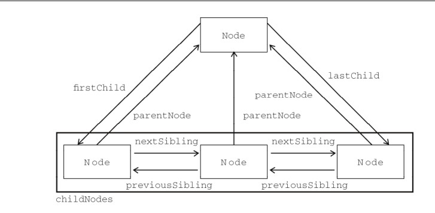
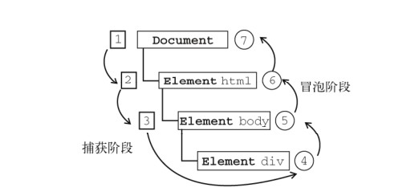

# 01 DOM简介
DOM描绘了一个层次化的节点树，允许开发人员添加、移除和修改页面的某一部分。
DOM是操作页面标记的跨平台，语言中立的方式。
1998年10月DOM 1级规范，称为W3C的推荐标准。

# 02 节点层次
## 2.1 Node类型
JavaScript中所有节点类型都继承自Node类型，因此所有节点类型都共享着相同的基本属性和方法。
每个节点都有一个`nodeType`属性，用于表明节点的类型。节点类型由在 Node 类型中定义的下列
12 个数值常量来表示，任何节点类型必居其一：
* Node.ELEMENT_NODE(1);
* Node.ATTRIBUTE_NODE(2);
* Node.TEXT_NODE(3);
* Node.CDATA_SECTION_NODE(4);
* Node.ENTITY_REFERENCE_NODE(5);
* Node.ENTITY_NODE(6);
* Node.PROCESSING_INSTRUCTION_NODE(7);
* Node.COMMENT_NODE(8);
* Node.DOCUMENT_NODE(9);
* Node.DOCUMENT_TYPE_NODE(10);
* Node.DOCUMENT_FRAGMENT_NODE(11);
* Node.NOTATION_NODE(12)

最常用的节点类型是**元素节点**和**文本节点**。
检测某个节点是什么类型，有2种方法：
```javascript
if (someNode.nodeType == Node.ELEMENT_NODE){ //在 IE 中无效
	alert("Node is an element.");
}

if (someNode.nodeType == 1){ // 适用于所有浏览器
	alert("Node is an element.");
}
```

### 2.1.1 nodeName 和 nodeValue
对于元素节点，nodeName保存元素的标签名，nodeValue的值为null
```javascript
if (someNode.nodeType == 1){
	value = someNode.nodeName; //nodeName 的值是元素的标签名
}
```

### 2.1.2 节点关系
文档树各节点之间的关系，类似与家谱图。
每个节点都有一个**childNodes**属性，其中保存着一个NodeList对象。
```javascript
var firstChild = someNode.childNodes[0];
var secondChild = someNode.childNodes.item(1);
var count = someNode.childNodes.length;
```

每个节点都有一个**parentNode**属性，该属性指向文档树中的父节点。此外，包含在childNodes列表中的
每个节点相互之间都是同胞节点。通过使用列表中每个节点的**previousSibling**和**nextSibling**属性，
可以访问同一列表中的其他节点。

父节点的**firstChild**和**lastChild**属性分别指向其childNodes列表中的第一个和最后一个节点。

一张节点关系参考图如下:


### 2.1.3 操作节点
1. 在末尾新增节点。`appendChild()`
```javascript
var returnedNode = someNode.appendChild(newNode);
alert(returnedNode == newNode); //true
alert(someNode.lastChild == newNode); //true
```

2. 插入节点。`insertBefore()`，该方法接受两个参数：要插入的节点和作为参照的节点。
```javascript
//插入后成为最后一个子节点
returnedNode = someNode.insertBefore(newNode, null);
alert(newNode == someNode.lastChild); //true

//插入后成为第一个子节点
var returnedNode = someNode.insertBefore(newNode, someNode.firstChild);
alert(returnedNode == newNode); //true
alert(newNode == someNode.firstChild); //true

//插入到最后一个子节点前面
returnedNode = someNode.insertBefore(newNode, someNode.lastChild);
alert(newNode == someNode.childNodes[someNode.childNodes.length-2]); //true
```

3. 替换节点。`replaceChild()`方法接受两个参数：要插入的节点和要替换的节点。被替换的节点将从文档中移除，
   新插入的节点，替换它原来的位置。
```javascript
//替换第一个子节点
var returnedNode = someNode.replaceChild(newNode, someNode.firstChild);
//替换最后一个子节点
returnedNode = someNode.replaceChild(newNode, someNode.lastChild);
```

4. 移除节点。`removeChild()`该方法接受一个参数：要被移除的节点。
```javascript
//移除第一个子节点
var formerFirstChild = someNode.removeChild(someNode.firstChild);
//移除最后一个子节点
var formerLastChild = someNode.removeChild(someNode.lastChild);
```

以上4个方法，操作的都是某个节点的子节点。

## 2.2 Document类型
document对象是window对象的一个属性，因此可以将其作为全局对象来访问。document对象为一些DOM操作，
提供了简单的操作方法，不过这些方法只适用与HTML文档。
```javascript
// 1. 取得对<body>的引用
var body = document.body;

// 2. 读写网页标题
var originalTitle = document.title;
document.title = "New page title";

// 3. 取得网页所有的<form>元素
document.forms 相当于 document.getElementsByTagName("form")

// 4. 取得网页中所有的元素
document.images 相当于 document.getElementsByTagName("img")
```

### 2.2.1 取得元素引用
```javascript
// 1. 通过id取得元素的引用
var div = document.getElementById("myDiv"); //取得<div>元素的引用

// 2. 通过标签名取得元素的引用
var images = document.getElementsByTagName("img");
alert(images.length); //输出图像的数量
alert(images[0].src); //输出第一个图像元素的 src 特性
alert(images.item(0).src); //输出第一个图像元素的 src 特性

/* 若果其中一张图片的HTML内容为： 
则可以通过下面的方法通过name值，拿到这个元素的引用。 */
var myImage = images.namedItem("myImage");
var myImage = images["myImage"]; // 与上面的代码功能一样

// 3. 取得文档中所有的元素
var allElements = document.getElementsByTagName("*");

// 4. 根据元素的name值取得元素的引用
var radios = document.getElementsByName("color");
```

### 2.2.2 文档写入
调试阶段可能会用上。
```javascript
document.write("hello world");
document.writeln("hello world"); // 自带换行
```

## 2.3 Comment类型
```javascript
// <div id="myDiv"><!--A comment --></div>
// 在此，注释节点是 <div> 元素的一个子节点，因此可以通过下面的代码来访问它。
var div = document.getElementById("myDiv");
var comment = div.firstChild;
alert(comment.data); //"A comment"
```

# 03 Element类型
可以像下面这样取得元素的的引用及其标签名：
```javascript
var div = document.getElementById("myDiv");
alert(div.tagName.toLowerCase()); // "div"
alert(div.tagName == div.nodeName); //true
```

## 3.1 元素基本属性的读写
一般的HTML元素，都有下面这些通用的属性。
* id - 元素在文档中唯一的标识符
* className - 元素所属的类，为了不予保留字冲突，没用'class'
* title - 有关元素的附加信息说明，一般通过工具条显示出来
  上述这些属性的读写，可以通过下面的代码实现：
```javascript
/* 假设HTML结构为： 
	<div id="myDiv" class="bd" title="Body text"></div> */
	
// 读
var div = document.getElementById("myDiv");
alert(div.id); //"myDiv""
alert(div.className); //"bd"
alert(div.title); //"Body text"

// 写
div.id = "someOtherId";
div.className = "ft";
div.title = "Some other text";
```

## 3.2 元素属性操作
操作属性的DOM的方法主要有3个：
* getAttribute()
* setAttribute()
* removeAttribute()
  示例如下：
```javascript
// 1. 读取属性
alert(div.getAttribute("id")); //"myDiv"
alert(div.getAttribute("class")); //"bd"
alert(div.getAttribute("title")); //"Body text"

// 2. 写入属性
div.setAttribute("id", "someOtherId");
div.setAttribute("class", "ft");
div.setAttribute("title", "Some other text");

// 3. 删除属性
div.removeAttribute("class");
```

## 3.3 创建元素
`document.createElement()`方法可以创建新的元素，这个方法接受一个参数：创建元素的标签名。
```javascript
// 1. 创建
var div = document.createElement("div");
// 2. 显示
document.body.appendChild(div);

```

# 04 Text类型
文本节点由Text类型表示，Text类型有以下特征：
* nodeType值为3
* nodeName值为"#text"
* nodeValue值为节点所包含的文本
* parentNode是一个Element
* 不支持（没有）子节点

在默认情况下，每个可以包含内容的元素，最多只能有一个文本节点，而且必须确实有内容存在。
```html
<!-- 没有内容，也就没有文本节点 -->
<div></div>
<!-- 有空格，因而有一个文本节点 -->
<div> </div>
<!-- 有内容，因而有一个文本节点 -->
<div>Hello World!</div>
<script>
var textNode = div.firstChild; //或者 div.childNodes[0];
div.firstChild.nodeValue = "Some other message";
</script>
```

## 4.1 创建文本节点
`createTextNode()`方法用来创建新的文本节点，该方法接受一个参数：要插入节点中的文本。
```javascript
var element = document.createElement("div");
element.className = "message";
var textNode = document.createTextNode("Hello world!");
element.appendChild(textNode);
document.body.appendChild(element);
```
### 4.1.1 规范化文本节点
正常情况下，一个元素只包含一个文本节点。但有时也可能包含两个以上的文本节点，这经常给后续
代码操作，带来不便，可以通过`normalize()`，合并多个文本节点。
```javascript
var element = document.createElement("div");
element.className = "message";
var textNode = document.createTextNode("Hello world!");
element.appendChild(textNode);
var anotherTextNode = document.createTextNode("Yippee!");
element.appendChild(anotherTextNode);
document.body.appendChild(element);
alert(element.childNodes.length); //2
element.normalize();
alert(element.childNodes.length); //1
alert(element.firstChild.nodeValue); // "Hello world!Yippee!"
```

## 4.2 分割文本节点
```javascript
var element = document.createElement("div");
element.className = "message";
var textNode = document.createTextNode("Hello world!");
element.appendChild(textNode);
document.body.appendChild(element);
var newNode = element.firstChild.splitText(5);
alert(element.firstChild.nodeValue); //"Hello"
alert(newNode.nodeValue); //" world!"
alert(element.childNodes.length); //2
```

# 05 DOM操作技术
## 5.1 动态脚本
在运行中动态的为页面添加脚本。

## 5.2 动态样式
动态样式是指在页面刚加载时不存在的样式，在页面加载完成后动态添加到页面中的。

## 5.3 使用NodeList
理解 NodeList 及其“近亲” NamedNodeMap 和 HTMLCollection ，是从整体上透彻理解 DOM 的
关键所在。这三个集合都是“动态的”，每当文档结构发生变化时，它们都会得到更新。从本质上说，所有
NodeList对象都是在访问DOM文档时实时运行的查询。

# 06 DOM扩展
对 DOM 的两个主要的扩展是 Selectors API（选择符 API）和 HTML5。

## 6.1 选择符API
Selectors API Level 1的两个核心方法：`querySelector()` 和`querySelectAll()`
### 6.1.1 querySelector()
querySelector()方法接受一个CSS选择符，返回与该模式匹配的第一个元素。
```javascript
//取得 body 元素
var body = document.querySelector("body");
//取得 ID 为"myDiv"的元素
var myDiv = document.querySelector("#myDiv");
//取得类为"selected"的第一个元素
var selected = document.querySelector(".selected");
//取得类为"button"的第一个图像元素
var img = document.body.querySelector("img.button");
```

### 6.1.2 querySelectorAll()
querySelectorAll()与querySelector()使用方法一样，只不过返回的是所有匹配的元素，即返回的是
一个NodeList的实例。
```javascript
//取得某<div>中的所有<em>元素（类似于 getElementsByTagName("em")）
var ems = document.getElementById("myDiv").querySelectorAll("em");
//取得类为"selected"的所有元素
var selecteds = document.querySelectorAll(".selected");
//取得所有<p>元素中的所有<strong>元素
var strongs = document.querySelectorAll("p strong");
```

## 6.2 元素遍历
对于元素之间的空格。IE9及之前的版本不会返回文本节点。而且它所有浏览器都会返回文本节点，这就导致
在使用childNodes和firstChild等属性时，行为不一致。
Element Traversal API 为 DOM 元素添加了以下 5 个属性。
* childElementCount - 返回子元素（不包括文本节点和注释）的个数。
* firstElementChild - 指向第一个子元素； firstChild 的元素版。
* lastElementChild - 指向最后一个子元素； lastChild 的元素版。
* previousElementSibling - 指向前一个同辈元素； previousSibling 的元素版。
* nextElementSibling - 指向后一个同辈元素； nextSibling 的元素版。
  支持的浏览器添加了这些属性，利用这些元素不必担心空白文本节点，从而可以更方便的查找DOM元素。

## 6.3 与HTML5相关的DOM
### 6.3.1  getElementsByClassName()
` getElementsByClassName()`方法接受一个参数：一个或多个类名的字符串，返回带有指定类的所有元素
的NodeList。传入多个类名时，类名的先后顺序不重要。
```javascript
// 取得所有类中包含"username"和"current"的元素，类名的先后顺序无所谓
var allCurrentUsernames = document.getElementsByClassName("username current");

//取得 ID 为"myDiv"的元素中带有类名"selected"的所有元素
var selected = document.getElementById("myDiv").getElementsByClassName("selected");
```

### 6.3.2  classList 属性
classList 属性是新集合类型 DOMTokenList 的实例。
* add(value) - 将给定的字符串值添加到列表中。如果值已经存在，就不添加了。
* contains(value) - 表示列表中是否存在给定的值，如果存在则返回 true ，否则返回 false 。
* remove(value) - 从列表中删除给定的字符串。
* toggle(value) - 如果列表中已经存在给定的值，删除它；如果列表中没有给定的值，添加它。
```javascript
// 移除某个指定的类，其它类不受次影响
div.classList.remove("user");

//删除"disabled"类
div.classList.remove("disabled");

//添加"current"类
div.classList.add("current");

//切换"user"类
div.classList.toggle("user");
```

### 6.3.3 焦点管理
```javascript
var button = document.getElementById("myButton");
button.focus();
alert(document.activeElement === button); //true

var button = document.getElementById("myButton");
button.focus();
alert(document.hasFocus()); //true
```

### 6.3.4 插入标记
```javascript
div.innerHTML = "Hello world!";
```

# 07 DOM 样式
本章重点介绍：DOM Level 2 Style

## 7.1 访问元素的样式
任何支持style特性的HTML元素，在JavaScript中都有一个对应的style属性。
部分CSS属性与JavaScript属性的对应关系列举如下：
* background-image 对应 style.backgroundImage
* color 对应 style.color
* display 对应 style.display
* font-family 对应 style.fontFamily
  只要取得一个有效的DOM引用，就可以随时使用JavaScript为其设置样式。
```javascript
var myDiv = document.getElementById("myDiv");

//设置背景颜色
myDiv.style.backgroundColor = "red";

//改变大小
myDiv.style.width = "100px";
myDiv.style.height = "200px";

//指定边框
myDiv.style.border = "1px solid black";

// 批量设置多个样式
myDiv.style.cssText = "width: 25px; height: 100px; background-color: green";
alert(myDiv.style.cssText);
```
以这种方式改变样式时，元素的外观会被自动更新。

相应的读取样式的方法如下：
```javascript
alert(myDiv.style.backgroundColor); //"blue"
alert(myDiv.style.width); //"10px"
alert(myDiv.style.height); //"25px"
```

### 7.1.1 移除样式
` myDiv.style.removeProperty("border"); `


### 7.2 计算的样式
style对象只能得到直接设置成style属性的样式，而得不到从其它样式表层叠而来并影响到当前元素的样式信息。使用`window.getComputedStyle()`方法可以得到计算后的样式。
这个函数有两个参数，第一个时需要计算样式的元素引用，第二个直接填`null`，
这个方法获取的元素样式信息是只读的。
```html
<!DOCTYPE html>
<html>
<head>
<title>Computed Styles Example</title>
<style type="text/css">
	#myDiv {
		background-color: blue;
		width: 100px;
		height: 200px;
	}
</style>
</head>
<body>
	<div id="myDiv" style="background-color: red; border: 1px solid black"></div>
	<script>
		var myDiv = document.getElementById("myDiv");
		var computedStyle = window.getComputedStyle(myDiv, null);
		console.log(computedStyle.length);  // 259(Chrome)
		console.log(computedStyle.backgroundColor);  // "red"
		console.log(computedStyle.width);   // "100px"
		console.log(computedStyle.height);  // "200px"
	</script>
</body>
</html>
```

# 08 事件
JavaScript与HTML的交互是通过事件实现的。

## 8.1 事件传播顺序
有两种顺序：
事件冒泡（event bubbling）：从最底层的目标开始沿着DOM树向上传播。
事件捕获（event capturing）：从DOM树的最上层开始，一直传播到最底层的目标元素。
```html
<!DOCTYPE html>
<html>
<head>
<title>Event Bubbling Example</title>
</head>
<body>
	<div id="myDiv">Click Me</div>
</body>
</html>
```
对于上述代码，当单击div元素时，对于事件冒泡来说，click事件的传播会按照以下顺序：
1. ` <div> `
2. ` <body> `
3. ` <html> `
4. ` document `

对于事件捕获来说，click事件的传播按照以下顺序：
1. ` document `
2. ` <html> `
3. ` <body> `
4. ` <div> `

## 8.2 DOM2级事件流
“DOM2级事件”规定的事件流包括三个阶段：事件捕获阶段、处于目标阶段和事件冒泡阶段。
以前面的HTML页面为例，单击div元素会按照下图所示顺序触发事件：


## 8.3 事件处理程序
响应某个事件的函数就叫做事件处理程序，也可以称为事件监听器。为事件指定处理程序的方式
有好几种。

###  8.3.1 HTML事件处理程序
```html
<input type="button" value="Click Me" onclick="alert('Clicked')">

<script type="text/javascript">
function showMessage(){
	alert("Hello world!");
}
</script>

<input type="button" value="Click Me" onclick="showMessage()">
```
使用HTML事件处理程序导致HTML与JavaScript代码紧密耦合，故一般不使用这种
方法。

### 8.3.2 DOM0级事件处理程序
每个元素都有自己的事件处理程序属性，这些属性通常全部小写，例如onclick。为这种属性的
值设置为一个函数，就可以指定事件处理程序。
```javascript
var btn = document.getElementById("myBtn");
btn.onclick = function(){
	alert("Clicked");
};

// 在DOM0级事件处理程序中，this引用的是当前元素
btn.onclick = function(){
	alert(this.id); //"myBtn"
};

// 删除事件处理程序
btn.onclick = null;
```

### 8.3.3 DOM2级事件处理程序
"DOM2级事件"定义了两个方法，用来绑定和删除元素的事件处理程序：`addEventListener()`
和`removeEventListener()`。所有DOM节点都包含这两个方法，并且它们都接受3个参数：要
处理的事件名、作为事件处理程序的函数、布尔值。最后一个布尔值参数如果是true，表示在捕获
阶段调用事件处理程序，如果是false表示在冒泡阶段调用事件处理程序。
```javascript
// 添加单个事件处理程序
var btn = document.getElementById("myBtn");
btn.addEventListener("click", function(){
	alert(this.id);
}, false);

// 添加多个事件处理程序
var btn = document.getElementById("myBtn");
btn.addEventListener("click", function(){
	alert(this.id);
}, false);
btn.addEventListener("click", function(){
	alert("Hello world!");
}, false);
// 上面两个单击事件的处理程序为按照顺序触发
```

使用`addEventListener()`添加的事件处理程序，只能使用`removeEventListener()`来移除，
移除时传入的参数与添加处理程序时传入的相同。因此，使用此方法添加的匿名函数，将无法被移除。
```javascript
var btn = document.getElementById("myBtn");
var handler = function(){
	alert(this.id);
};
btn.addEventListener("click", handler, false);
btn.removeEventListener("click", handler, false);
```

> 推荐在事件冒泡阶段添加事件处理程序。

### 8.3.4 IE事件处理程序
IE实现了与DOM中类似的两个方法： attachEvent() 和 detachEvent()。
这两个方法接受相同的两个参数：事件处理程序名称与事件处理程序函数。
IE8及更早版本只支持事件冒泡。
```javascript
var btn = document.getElementById("myBtn");
var handler = function(){
	alert("Clicked");
};
btn.attachEvent("onclick", handler);
btn.detachEvent("onclick", handler);
```

### 8.3.5 跨浏览器的事件处理程序
```javascript
// 要绑定事件的元素  绑定事件的类型  事件处理函数
var EventUtil = {
    addHandler: function(element, type, handler) {
        if (element.addEventListener) {
            element.addEventListener(type, handler, false);
        } else if (element.attachEvent) {
            element.attachEvent("on" + type, handler);
        } else {
            element["on" + type] = handler;
        }
    },
    removeHandler: function(element, type, handler) {
        if (element.removeEventListener) {
            element.removeEventListener(type, handler, false);
        } else if (element.detachEvent) {
            element.detachEvent("on" + type, handler);
        } else {
            element["on" + type] = null;
        }
    }
};
```
这两个方法都是首先检测传入的元素是否存在DOM2级方法。如果存在DOM2级方法，则使用该方法：
传入事件类型、事件处理程序函数、false（表示冒泡阶段）

使用EventUtil对象示例：
```javascript
var btn = document.getElementById("myBtn");
var handler = function(){
	alert("Clicked");
};
EventUtil.addHandler(btn, "click", handler);
// 这里省略了其他代码
EventUtil.removeHandler(btn, "click", handler);
```

## 8.4 事件对象
### 8.4.1 event对象
在**事件处理函数**中，始终都有一个**event**对象，这东西就给this差不多，在事件处理函数中，
一直都在。
event对象有很多属性和方法，比较常用的有下面这些：

| 属性/方法            | 类型       | 读/写  | 说明        |
| ---------------- | -------- | ---- | --------- |
| type             | String   | 只读   | 被触发事件的类型  |
| preventDefault() | Function | 只读   | 取消事件的默认行为 |

下面的代码，展示了event对象的存在。
```html
<!DOCTYPE html>
<html>
<head>
	<meta charset="utf-8">
	<title>event的存在</title>
</head>
<body>
<input type="button" value="Click Me 1" onclick="alert(event.type)"/>

<input type="button" value="Click Me 2" id="btn" />
<script>
	function handler(x2) {
		console.log(x2); // 不管x2取什么值都能打印出来event对象
		// event = "hsss";
		console.log(event); // event对象默认的名字
		var x2 = "xxx";
		console.log(x2);
		console.log(event);
	}
	var btn = document.getElementById("btn");
	btn.addEventListener("click", handler, false);
</script>
</body>
</html>
```

### 8.4.2 阻止事件的默认行为
有些事件或者说元素的默认行为让人很烦，比如把超链接当按钮时的时候，我们就不需要"跳转"，
这个默认行为。使用`event.preventDefault()`就可以阻止事件的默认行为。
```javascript
var link = document.getElementById("myLink");
link.onclick = function(event){
	event.preventDefault();
};
```
> 事件处理程序执行完毕，event对象自动被销毁。

### 8.4.3 IE中的事件的对象
在兼容问题上，IE的坑爹之路，从未停下脚步。
```javascript
var btn = document.getElementById("myBtn");
btn.onclick = function(){
var event = window.event;
	alert(event.type); //"click"
};
```

### 8.4.4 跨浏览器的事件对象
```javascript
var EventUtil = {
    addHandler: function(element, type, handler) {
        //省略的代码
    },
    getEvent: function(event) {
        return event ? event: window.event;
    },
    getTarget: function(event) {
        return event.target || event.srcElement;
    },
    preventDefault: function(event) {
        if (event.preventDefault) {
            event.preventDefault();
        } else {
            event.returnValue = false;
        }
    },
    removeHandler: function(element, type, handler) {
        //省略的代码
    },
    stopPropagation: function(event) {
        if (event.stopPropagation) {
            event.stopPropagation();
        } else {
            event.cancelBubble = true;
        }
    }
};
```

## 8.5 事件类型
DOM3级事件模块规定了以下事件：
* UI事件 - 用户与页面上的元素交互时触发
* 焦点事件 - 当元素获得或失去焦点时触发
* 鼠标事件 - 当用户通过鼠标在页面上执行操作时触发
* 滚轮事件 - 当使用鼠标滚轮时触发
* 文本事件 - 当在文档中输入文本时触发
* 键盘事件 - 当用户通过键盘在页面上执行操作时触发

### 8.5.1 UI事件
现有的UI事件如下：
* load - 页面、图片等加载完成时触发
* unload - 页面完全卸载后在window上触发
* select - 当用户选择文本中的一个或多个字符时触发
* resize - 当窗口的大小变化时在window上面触发
* scroll - 当用户滚动待滚动条的内容时，在该元素上面触发


