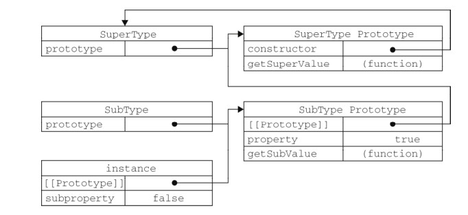

[TOC]

# 01 JavaScript 简介

JavaScript was invented by Brendan Eich in 1995, and became an ECMA standard in 1997.
ECMA-262 is the official name of the standard. ECMAScript is the official name of the language.
JavaScript目前最新的版本为2016年发布的ECMAScript 7, 也称为ECMAScript 2016.

## 1.1 JavaScript / ECMAScript / JScript
JavaScript was developed for Netscape. The first browser to run JavaScript was Netscape 2 in 1996. After Netscape the Mozilla foundation continued to develop JavaScript for the Firefox browser. JavaScript version numbers run from 1.0 to 1.8.

ECMAScript was developed by Ecma International after the organization adopted JavaScript. The first edition of ECMAScript was released in 1997. ECMAScript version numbers run from 1 to 7.

JScript was developed by Microsoft as a compatible JavaScript language for Internet Explorer in 1996. JScript version numbers runs from 1.0 to 9.0. 

## 1.2 功能概要
1. 改变HTML内容
   ` document.getElementById("demo").innerHTML = "Hello JavaScript"; `

2. 改变HTML属性
   ` document.getElementById('myImage').src='pic_bulboff.gif'; `

3. 改变HTML样式(CSS)
   ` document.getElementById("demo").style.fontSize = "25px"; `

4. 隐藏和显示HTML元素
```javascript
document.getElementById("demo").style.display = "none";
document.getElementById("demo").style.display = "block";
```

## 1.3 放在哪
1. 嵌套在HTML中, 使用`<script></script>`标签。
2. 放在外部`.js`文件中, 然后在HTML中引用。
3. 建议把对js文件的引用放在文档最后。
```html
<script src="myScript1.js"></script>
<script src="myScript2.js"></script>
```

## 1.4 常见输出方式
在调试代码JavaScript环节经常需要输出一些变量信息等，在JavaScript中，大致有以下4种输出方式。
1. ` document.getElementById("demo").innerHTML = 5 + 6; `
2. ` document.write() `
3. ` window.alert() `
4. ` console.log() `

## 1.5 注释
单行注释 //
多行注释 /* */

## 1.6 变量
变量名大小写敏感，变量不能以数字开头，下划线_，美元符$，允许出现在变量名中。但中划线-不能出现在变量名中。

# 02 数据类型

## 2.2 typeof 操作符
类似于加减乘除，`typeof`是JavaScript中的操作符。
`typeof`用来检测给定变量的数据类型。其返回值情况如下：
* "undefined" - 如果这个值未定义
* "boolean" - 若果这个值是布尔值
* "string" - 如果这个值是字符串
* "number" - 如果这个值是数值
* "object" - 如果这个值是对象或null
* "function" - 如果这个值是函数
```javascript
typeof "John Doe"          // Returns "string"
typeof 3.14                // Returns "number"
typeof true                // Returns "boolean"
```

> 从技术角度讲，函数在 ECMAScript中是对象，不是一种数据类型。然而，函数也
> 确实有一些特殊的属性，因此通过 **typeof** 操作符来区分函数和其他对象是有必要的。


## 2.3 基本数据类型
最简单的数据类型。
* string
* number
* boolean
* null
* undefined

## 2.4 引用数据类型
* function
* object
```javascript
typeof [1,2,3,4]             // Returns "object" (not "array", see note below)
typeof {name:'John', age:34} // Returns "object"
typeof function myFunc(){}   // Returns "function"
```
**The typeof operator returns "object" for arrays because in JavaScript arrays are objects.**

## 2.5 基本类型与引用类型比较
* 基本类型值在内存中占据固定大小的空间，因此被保存在栈内存中
* 从一个变量向另一个变量复制基本类型的值，会创建这个值的一个副本
* 引用类型的值是对象，保存在堆内存中
* 包含引用类型值的变量实际上包含的并不是变量本身，而是一个指向该对象的指针
* 从一个变量向另一个变量复制引用类型的值，复制的其实是指针，因此两个变量最终都指向同一个对象


## 2.5 Undefined、空值、Null
```javascript
var person;                // Value is undefined, type is undefined
person = undefined;        // Value is undefined, type is undefined

var car = "";              // The value is "", the typeof is "string"

var person = null;         // Value is null, but type is still an object

typeof undefined           // undefined
typeof null                // object
null === undefined         // false
null == undefined          // true
```
一般不将变量显示声明为undefined，声明空对象应将其赋值为null

## 2.6 数值
### 2.6.1 整数
* 33
* -1000
* 0
* -1

### 2.6.2 浮点数
* 3.0
* 0.0001
* -99.99
* 2.5e12 (2.5 * 10^12)
* 1e-12

### 2.6.3 非数值(NaN)
把非数值当做数值来处理时，其返回结果就可能是NaN(Not a Number),利用isNaN()函数能够检查非数值：
```javascript
isNaN(3);  // 返回false
isNaN("horse"); // 返回true
```

### 2.6.4 数值转换
JavaScript提供了两个可以把字符串强制转换为数值格式的函数。
parseFloat()解析字符串并返回一个浮点数。
```javascript
parseFloat("21.4"); // 返回21.4
parseFloat("76 hello"); // 返回76
parseFloat("The magnificent 7"); // 返回NaN
```

parseInt()解析字符串并返回一个浮点数。
```javascirpt
parseInt(18.95); //返回18
parseInt("12px"); //返回12
parseInt("hello"); //返回NaN
```

### 2.6.5 进制
JavaScript默认使用十进制
八进制：有效序列0-7，前导0
十六进制：有效序列0-9，A-F，前导0x

### 2.6.5 无穷大(Infinity)
超过JavaScript能够表示的最大数值，就是无穷大，当然也可以是负无穷大(-Infinity)。
isFinite()会把参数解析为数值，只要解析结果为不合法数值例如NaN、Infinity、-Infinity，函数返回false。
合法范围则返回true。

## 2.7 字符串
```javascript
var myString = "This is a string";
var emptyString = ""; //定义一个空字符串
var linkString = "hello" + "world";
```
使用`.length`可以访问字符串的长度，但是无法精确返回双字节字符长度。
ECMAScript中字符串一旦创建，它的值就不能改变。

### 2.7.1 转义序列
键盘上打不上去的字符，或者已经有特殊用途的字符，直接放不到字符串里，就要使用转义序列(escape sequence)。
* \t - 制表符
* \n - 换行
* \" - 双引号
* \' - 单引号
* \\ - 反斜线

### 2.7.2 字符串方法
**indexOf()**
这个函数可以查找字符串在另一个字符串里第一次出现的位置，找到返回字符串在目标字符串里的索引，
如果没找到，就返回-1。
```javascript
var string = "The quick brown fox";
string.indexOf("h");	// 返回 1
string.indexOf("fox"); // 返回16 找到返回其下标索引值
string.indexOf("dog"); // 返回-1 没找到
```

**lastIndexOf()**
与indexOf()工作方式类似，返回字符串最后一次出现的位置。

**replace()**
在目标字符串里搜索与字符串匹配的内容，并且用新的字符串替换它: 
```javascript
var string = "hello world_xxx";
// 把 world_xxx 替换成 world
var newString = string.replace("world_xxx", "world");
console.log(newString);  // hello world
```

**split()**
把字符串分解成多个字符串的一个数组，并且返回这个新数组。
```javascript
var string1 = "The quick brown fox";
var newString = string1.split(" "); // 以 空格 分割
console.log(newString); // ["The", "quick", "brown", "fox"]

var string1 = "xing-yong-sheng";
var newString = string1.split("-"); // 以 - 分割
console.log(newString); // ["xing", "yong", "sheng"]
```

**substr()**
截取制定字符串，如果此函数有1个参数，则截取从起始位置到字符串结束的全部字符。
如果有两个参数，则截取从起始位置到第2个参数指定的位置中间这部分字符串。
```javascript
var string = "The quick brown fox";
var sub1 = string.substr(4, 11); // 提取 "quick brown"
var sub2 = string.substr(4); // 提取 "quick brown fox"
```

**substring()**
截取字符串。语法`string.substring(from, to)`，截取字符串的区间为`[from, to)`
```javascript
var str="hello_world";
console.log(str.substring(2)); // llo_world
console.log(str.substring(2, 5)); // llo
```


**toLowerCase() and toUpperCase()**
大小写转换。

**charCodeAt()**
返回字符的ASCII码值。
```javascript
var arr = "s";
arr.charCodeAt(0); // display 115
```

### 2.7.3 转换为字符串
要把一个变量转换为字符串最常用的方法是`toString()`
```javascript
var age = 11;
var ageAsString = age.toString(); // 字符串"11"
var found = true;
var foundAsString = found.toString(); // 字符串"true"
```
null和undefined没有`toString()`，可以使用转型函数`String()`，它遵循下面的
转换规则：
* 如果值有 toString() 方法，则调用该方法并返回相应的结果；
* 如果值是 null ，则返回 "null" ；
* 如果值是 undefined ，则返回 "undefined" 。 
```javascript
var value1 = 10;
var value2 = true;
var value3 = null;
var value4;
alert(String(value1)); // "10"
alert(String(value2)); // "true"
alert(String(value3)); // "null"
alert(String(value4)); // "undefined"
```

### 2.7.4  字符串的数组属性

在JavaScript中，字符串也可以当成数组来访问。

```javascript
var str = "hello";
console.log(str.length); // 5
console.log(str[0]); // h
```


## 2.8 布尔值

布尔类型的数据只有两个值：true或false。
在JavaScript中一切非0值当做true来处理。0值当做false处理，下面这些值在JavaScript
中也当做false来处理。
* false
* undefined
* null
* 0
* NaN
* ""

# 03 函数
## 3.1 基本概念
在任何语言中函数都是一个核心的概念，函数可以封装任意多条语句，并且在
需要的时候随时调用。
```javascript
/*
function name(parameter1, parameter2, parameter3) {
    code to be executed
}
*/

// 不带返回值的函数
function sayHi() {
	console.log("hello world!");
}

// 带返回值的函数
function sum(num1, num2) {
	return num1 + num2;
}
```
函数的参数只能在函数内部使用，属于本地变量。
`name`代表函数的名字。
`name()`调用函数。
在函数中直接运行`return;`代表函数结束，此时函数将返回`undefined`。
函数的返回值可以是JavaScript支持的任何数据类型。
> 推荐让函数要么永远返回 一个值，要么永远不要返回值。

## 3.2 理解参数
在ECMAScript中函数的参数非常灵活。函数的参数名，只是一种简易的名称指示。在函数体内还可以使用`arguments`对象来访问，函数的参数数组。`arguments.length`属性可以得到，函数参数的数量。
```javascript
function sayHello(arg1, arg2) {
	console.log(arguments.length);
}
sayHello(); // 0
sayHello(x1=2, x2=3); // 2
sayHello(x1=2, x2=3, x3=4, x4=8); // 4

function add(num1, num2) {
	return arguments[0] + arguments[1];
}
var sum = add(2, 3);
console.log(sum); // 5
```

arguments有一个名叫callee的属性，该属性是一个指针，指向拥有这个arguments对象的函数。
```javascript
// 1. 函数与函数名紧紧耦合
function factorial(num) {
	if (num <=1) {
		return 1;
	} else {
		return num * factorial(num-1);
	}
}

// 2. 使用arguments.callee() 解耦合
function factorial(num){
	if (num <=1) {
		return 1;
	} else {
		return num * arguments.callee(num-1);
	}
}
```

## 3.3 对函数名的深入理解
函数实际上是对象，每个函数都是Function类型的实例，而且都与其它引用类型一样具有属性和方法。由于函数是对象，因此函数名也是一个指向函数对象的指针，不会与某个函数绑定。
下面给出函数的3中定义方法，帮助理解：
```javascript
// 1. 函数声明
function sum (num1, num2) {
	return num1 + num2;
}

// 2. 函数表达式
var sum = function(num1, num2) {
	return num1 + num2;
};

// 3. 使用Function构造函数 - 这种方法只是帮助我们理解，并不推荐使用
var sum = new Function("num1", "num2", "return num1 + num2");
```
**函数是对象，函数名是指针**

## 3.4 函数声明和函数表达式的区别
函数声明与函数表达式没有太大的区别，主要的一点就是使用函数声明定义的函数，在任何代码执行前会自动有一个**提前**的过程。
```javascript
// 正确，代码能够正常执行。
alert(sum(10,10));
function sum(num1, num2){
	return num1 + num2;
}

// 错误。错误提示：unexpected identifier0
alert(sum(10,10));
var sum = function(num1, num2) {
	return num1 + num2;
};
```

## 3.5 作为变量的函数
函数名本身就是变量。所以在ECMAScript中，变量有的功能，函数全都有。
比如函数可以作为另一个函数的参数，函数也可以作为另一个函数的结果返回。
```javascript
function callSomeFunction(someFunction, someArgument){
	return someFunction(someArgument);
}

function add10(num){
	return num + 10;
}
var result1 = callSomeFunction(add10, 10);
alert(result1); //20

function getGreeting(name){
	return "Hello, " + name;
}
var result2 = callSomeFunction(getGreeting, "Nicholas");
alert(result2); //"Hello, Nicholas"
```
这里的 `callSomeFunction()` 函数是通用的，即无论第一个参数中传递进来的是什么函数，它都
会返回执行第一个参数后的结果。还记得吧，要访问函数的指针而不执行函数的话，必须去掉函数名后面的那对圆括号。因此上面例子中传递给 `callSomeFunction() `的是 `add10`和 `getGreeting` ，而不是执行它们之后的结果。

## 3.6 this对象
`this`引用的是函数据以执行的环境对象。
```javascript
window.color = "red";
var o = { color: "blue" };
function sayColor(){
	alert(this.color);
}
sayColor(); // "red"
o.sayColor = sayColor;
o.sayColor(); // "blue"
```
由于在调用函数之前，this的值并不确定，因此this可能会在代码执行过程中引用不同的对象。当在全局作用域中调用`sayColor()`时，this引用的是全局对象。而当把这个函数赋给对象o，并调用`o.sayColor()`，this引用的是对象o。
> `sayColor()` 与 `o.sayColor()` 指向的仍然是同一个函数

## 3.7 函数的属性
每个函数都包含两个属性：`length` 和 `prototype`。
`length`属性包含函数希望接受的命名参数的个数。
```javascript
function sayName(name){
	alert(name);
}
function sum(num1, num2){
	return num1 + num2;
}
function sayHi(){
	alert("hi");
}
alert(sayName.length); //1
alert(sum.length); //2
alert(sayHi.length); //0
```
`prototype`非常强非常重要，预留空位，待补充。

## 3.8 函数的方法
每个函数都包含两个非继承而来的方法：`apply()` 和 `call()`。这两个方法都是在特定的作用域中调用函数，实际上等于设置函数体内`this`的值。
```javascript
window.color = "red";
var o = { color: "blue" };
function sayColor(){
	console.log(this.color);
}
/* 问题提出: 上面的代码，我们定义sayColor()函数，我们想要对象o也可以使用这个函数，最简单的方法就是o.sayColor = sayColor; 但是这样函数和对象就有了绑定关系，能不能不用绑定函数和对象，而直接使用该函数的功能呢？ apply() 和 call() 正是为了解决这类问题。 */

sayColor(); // red
sayColor.call(this); // red 
sayColor.call(window); // red
sayColor.call(o); // blue
sayColor.apply(o); // blue
```

ECMAScript 5 还定义了一个方法： `bind()`
```javascript
window.color = "red";
var o = { color: "blue" };
function sayColor(){
	console.log(this.color);
}
var objectSayColor = sayColor.bind(o);
objectSayColor(); //blue
/* sayColor()调用bind()并传入对象o，这样objectSayColor()函数的this对象就被绑定为o，因此即使实在全局作用域中调用这个函数，也会返回 blue */
```


# 04 对象


## 4.1 对象简单理解
大多数引用类型都是Object类型的实例。其创建方法有两种：
```javascript
// 1. 使用new操作符
var person = new Object();
person.name = "asheng";
person.age = "23";
person.sayName = function(){
	console.log(this.name);
};

// 2. 使用对象字面量
var person = {
	name: "asheng",
	age: 23
	sayname: function() {
      console.log(this.name);
	}
};

// 3. 使用[]来访问对象的属性
person["name"];
person["first name"];
person[propertyName]; // propertyName 是变量名
```

## 4.2 创建对象
使用Object构造函数或对象字面量都可以创建单个对象，但这种方式创建的对象，很难实现代码复用。
### 4.2.1 工厂模式
直白的看就是创建一个函数，这个函数的返回值是对象。
```javascript
function createPerson(name, age, job){
	var o = new Object();
	o.name = name;
	o.age = age;
	o.job = job;
	o.sayName = function(){
		console.log(this.name);
	};
	return o;
}
var person1 = createPerson("jzz", 21, "Software Engineer");
var person2 = createPerson("xys", 23, "Doctor");
```

### 4.2.2 构造函数模式
```javascript
function Person(name, age, job){
	this.name = name;
	this.age = age;
	this.job = job;
	this.sayName = function(){
		console.log(this.name);
	};
}
var person1 = new Person("jzz", 21, "Software Engineer");
var person2 = new Person("xys", 23, "Doctor");
```
对上面代码的理解：
**Person()**只是一个普通的函数，与其它ECMAScript中的函数没有任何区别。只不过在调用时，我们使用了`new`操作符。
**Person()**首字母大写，仅仅是推荐写法，首字母也可以不大写。
`person`和`person2`分别保存着`Person`的一个不同的实例，这两个对象都有一个`constructor`属性，该属性指向`Person`
```javascript
console.log(person1.constructor == Person); //true
console.log(person2.constructor == Person); //true
```
也可以使用`instanceof`来检测对象类型。
```javascript
console.log(person1 instanceof Object); //true
console.log(person1 instanceof Person); //true
console.log(person2 instanceof Object); //true
console.log(person2 instanceof Person); //true
```
构造函数创建对象的问题是，对象的方法是跟具体对象绑定了，每创建一个新的对象，其方法也也要完全重新创建一遍。

### 4.2.3 组合使用构造函数模式和原型模式
这种创建对象的模式，使用最为广发。
```javascript
function Person(name, age, job) {
	this.name = name;
	this.age = age;
	this.job = job;
	this.friends = ["Shelby", "Court"];
}
Person.prototype = {
	constructor : Person,
	sayName : function(){
		alert(this.name);
	}
}
var person1 = new Person("Nicholas", 29, "Software Engineer");
var person2 = new Person("Greg", 27, "Doctor");
person1.friends.push("Van");
alert(person1.friends); //"Shelby,Count,Van"
alert(person2.friends); //"Shelby,Count"
alert(person1.friends === person2.friends); //false
alert(person1.sayName === person2.sayName); //true
```

## 4.3 原型对象
ECMAScript中的原型（prototype）非常绕，本想尝试着自己用电脑绘制类图，便于理解。无奈画实在太差，没法入目。还是直接贴高设3书上的截图吧。
 每创建一个函数都有一个原型属性，这个属性是一个指针，指向一个对象。
函数、原型、实例之间的关系，参考下面的代码和图片：
```javascript
function Person(){
}
Person.prototype.name = "Nicholas";
Person.prototype.age = 29;
Person.prototype.job = "Software Engineer";
Person.prototype.sayName = function(){
	alert(this.name);
};
var person1 = new Person();
person1.sayName(); //"Nicholas"
var person2 = new Person();

person2.sayName(); //"Nicholas"
alert(person1.sayName == person2.sayName); //true
```


### 4.3.1 检测对象和原型的关系
```javascript
alert(Person.prototype.isPrototypeOf(person1)); //true
alert(Person.prototype.isPrototypeOf(person2)); //true

alert(Object.getPrototypeOf(person1) == Person.prototype); //true
alert(Object.getPrototypeOf(person1).name);  //"Nicholas"
```

### 4.3.2 覆盖原型中的属性或方法
```javascript
function Person(){
}
Person.prototype.name = "Nicholas";
Person.prototype.age = 29;
Person.prototype.job = "Software Engineer";
Person.prototype.sayName = function(){
	alert(this.name);
};
var person1 = new Person();
var person2 = new Person();
person1.name = "Greg";
alert(person1.name); //"Greg" - 来自实例
alert(person2.name); //"Nicholas" - 来自原型
```

### 4.3.3 更简单的原型语法
```javascript
function Person(){
}
Person.prototype = {
	constructor : Person,
	name : "Nicholas",
	age : 29,
	job: "Software Engineer",
	sayName : function () {
		alert(this.name);
	}
};
```
### 4.3.4 原型对象的问题
```javascript
function Person(){
}
Person.prototype = {
	constructor: Person,
	name : "Nicholas",
	age : 29,
	job : "Software Engineer",
	friends : ["Shelby", "Court"],
	sayName : function () {
		alert(this.name);
	}
};
var person1 = new Person();
var person2 = new Person();
person1.friends.push("Van");
alert(person1.friends); //"Shelby,Court,Van"
alert(person2.friends); //"Shelby,Court,Van"
alert(person1.friends === person2.friends); //true
```

## 4.4 原型链
原型链是ECMAScript中实现继承的主要方法，
```javascript
function SuperType(){
	this.property = true;
}

SuperType.prototype.getSuperValue = function(){
	return this.property;
};

function SubType(){
	this.subproperty = false;
}
//继承了 SuperType
SubType.prototype = new SuperType();
SubType.prototype.getSubValue = function (){
	return this.subproperty;
};
var instance = new SubType();
alert(instance.getSuperValue()); //true
```



# 05 作用域
作用域规定了变量的访问范围。
在JavaScript中对象和函数也是变量。

## 5.1 局部变量
在函数中定义的变量属于本地变量。
```javascript
// code here can not use carName

function myFunction() {
    var carName = "Volvo";

    // code here can use carName

}
```
Local variables are created when a function starts, and deleted when the function is completed.

## 5.2 全局变量
```javascript
var carName = " Volvo";

// code here can use carName

function myFunction() {

    // code here can use carName 

}
```

## 5.3 Automatically Global
```javascript
myFunction();

// code here can use carName 

function myFunction() {
    carName = "Volvo";
}
```
Do NOT create global variables unless you intend to.

In "Strict Mode" automatically global variables will fail.

## 5.4 优先级
* 局部变量高于同名全局变量
* 参数变量高于同名全局变量
* 局部变量高于同名参数变量

## 5.5 特性
* 全局变量是全局对象的属性
* 局部变量是调用对象的属性
* 内层函数可访问外层函数局部变量
* 外层函数不能访问内层函数局部变量

# 06 BOM
## 6.1 与用户交互
### 6.1.1 alert()
`alert()`用于向用户弹出一个信息对话框和一个"OK"按钮，在对话框被关闭之前，脚本停止运行。
`alert()`没有返回值。

### 6.1.2 confirm()
`confirm()`也弹出一个信息对话框，但给用户提供了选择"OK"或"Cancel"，单击不同的按钮返回值不同，"OK"返回true，
"Cancel"返回false，在关闭对话框之前，脚本暂停运行。

### 6.1.3 prompt()
`prompt()`是打开模态对话框的另一种模式，它允许用户输入信息。

> 术语“模态”(modal)意味着脚本暂时停止运行，页面与用户机交互也被暂停，直到用户关闭对话框为止。

`prompt()`的使用方式如下：
```javascript
var answer = prompt("What is your full name?", "John Doe");
```
当用户单击"OK"时返回值就是用户输入的字符串。
第2个参数是可选的，表示如果用户输入为空，则以第2个参数的内容作为其默认值。
如果用户简单关闭了这个对话框，也就是单击了"Cancel"按钮，则返回值就是null。

> JavaScript在某些情况下使用null表示空值，作为数值使用时它表示0，作为字符串使用时
> 它表示空字符串，作为布尔值时，它表示false。

## 6.2 Location对象
location对象包含当前加载页面的URL信息。
URL组成方式如下：

` [协议]://[主机名]:[端口]/[路径][搜索][hash] `

下面是一个URL示例：

` http://www.example.com:8080/tools/display.php?section=435#list `

location对象的一系列属性包含了URL各个部分的数据。
* location.href - `http://www.example.com:8080/tools/display.php?section=435#list`
* location.protocol - `http:`
* location.host - `www.example.com:8080`
* location.hostname - `www.example.com`
* location.port - `8080`
* location.pathname - `/tools/display.php`
* location.search - `?section=435`
* location.hash - `#list`

### 6.2.1 使用location对象导航
利用location对象有两种方式可以帮助用户导航至新页面。
第一种是直接设置`location.href`为一个新的值：` location.href = "www.newpage.com" `，
这种方法跳转到新页面时，原始页面还留在浏览器的历史记录里，可以通过浏览器的"Back"按钮，回到原来
的网页。
第二种是使用`location.replace()`：`location.replace("www.newpage.com");`
这样就会在浏览器和历史记录里都使用新的URL来代替旧的。

### 6.2.2 利用location对象刷新页面
要实现刷新当前页面，也就是相当于用户单击了"reload"按钮，可以使用`location.reload()`来实现。
为了避免浏览器加载缓存的内容，确保从服务器重新获得页面数据，可以在调用reload()时添加参数true:

	location.reload(true);

# 07 数组
数组这种数据类型可以在一个变量中保存多个值，每个值可以是JavaScript中的任何数据类型。
JavaScript中数组的特性：
* 数组是对象
* 数组的索引从0开始
* 数组长度是弹性的，可自由伸缩
* 数组的索引可以是字符串
* 对象可以包含数组，数组也可以包含对象
## 7.1 创建数组
```javascript
// 空数组
var myArray = new Array();
var myArray = []; // 推荐使用这种方法创建新数组

// 指定数组长度
var myArray = new Array(size);

// 初始化创建数组
var myArray = ['Monday', 'Tuesday', 'Wednesday'];

/*
	通过arrName.length可以获取数组的长度，这个值是可读可写的。
*/
```

## 7.2 数组的基本操作

### 7.2.2 读写数组
```javascript
// 创建
var myArray = ['Monday', 'Tuesday', 'Wednesday'];

// 使用索引进行读写
console.log(myArray[0]);
myArray[0] = "hello";
console.log(myArray); 
```

### 7.2.3 增加数组元素
```javascript
var myArray = ['Monday', 'Tuesday', 'Wednesday'];
myArray[myArray.length] = "Thursday";
console.log(myArray);
```

### 7.2.4 删除数组元素
delete array_name[index]

### 7.2.5 遍历数组
```javascript
var myArray = ['Monday', 'Tuesday', 'Wednesday', 'Thursday', 'Friday', 'Saturday', 'Sunday'];
// 方法1 
for(var i=0; i<myArray.length; i++) {
	console.log(myArray[i]);
}

// 方法2
console.log("\n");
var myArray = ['hello', 'world', 'Wednesday', 'Thursday', 'Friday', 'Saturday', 'Sunday'];
for (var key in myArray) {
	console.log(myArray[key]);
}
```

### 7.2.6 字符串索引数组
数组的索引可以是字符串。
```javascript
var arr = new Array();
arr["hello"] = "world";
```
当数组的索引是字符串的时候，数组的`length`属性不再生效。
```javascript
var pbook = new Array();
pbook["David"] = 1;
pbook["Jennifer"] = 2;
print(pbook.length); // displays 0
```

## 7.3 数组方法_ECMAScript 3
### 7.3.1 添加
**push()**
在数组末尾添加元素。
```javascript
var myArray = ['Monday', 'Tuesday'];
myArray.push("Wednesday");
console.log(myArray);
```

**unshift()**
在数组头部添加元素。
```javascript
var myArray = ['Tuesday', 'Wednesday'];
myArray.unshift("Monday");
console.log(myArray);
```

**concat()**
合并两个数组。
```javascript
var arr1 = ['Monday', 'Thuesday'];
var arr2 = ['Wednesday', 'Thursday'];
var arr3 = arr1.concat(arr2);
console.log(arr3);
```

### 7.3.2 删除
**pop()**
删除并返回数组的最后一个元素。
```javascript
var myArray = ['Monday', 'Tuesday', 'Wednesday'];
var delArray = myArray.pop();
console.log(delArray + '\n');
console.log(myArray);
```

**shift()**
删除并返回数组的第一个元素。
```javascript
var myArray = ['Monday', 'Thuesday', 'Wednesday'];
var delArray = myArray.shift();
console.log(delArray + '\n');
console.log(myArray);
```

### 7.3.3 splice()
splice()用于插入、删除、或替换数组的元素。

此方法会直接改变原始数组。

此方法一般用来对数组中间的部分元素进行，删除、修改等操作。

语法：
` array.splice(index, howmany, item1,.....,itemX) `
参数解释：

* index - 必须。规定从何处添加/删除元素。必须是数字。
* howmany - 必须。规定应该删除多少元素。必须是数字。如果未指定此参数，则删除从index开始，
  一直到末尾的所有元素。若果该参数是0，则表示要增加元素。
* item1, ...... , itemX - 可选。要添加到数组的新元素。
```javascript
// 示例1 移除数组的第3个元素，并在数组第3个位置添加新元素。
var fruits1 = ["Banana", "Orange", "Apple", "Mango"];
fruits1.splice(2, 1, "Lemon", "Kiwi");
console.log(fruits1);

// 示例2 从第3个位置开始，删除数组后的2个元素。
var fruits2 = ["Banana", "Orange", "Apple", "Mango"];
fruits2.splice(2, 2);
console.log(fruits2);

// 示例3
var nums = [1,2,3,7,8,9];
var newElements = [4,5,6];
nums.splice(3,0,newElements);
console.log(nums);
```

### 7.3.4 slice()
slice()可以从已有的数组中返回选定的元素。
slice()可以提取字符串的某个部分，并以新的字符串返回被提取的部分。
语法：
array.slice(start, end)
参数解释：
* start - 必须。规定从何处开始选取。-1指最后1个元素，-2指倒数第2个元素， 以此类瑞。
* end - 可选。规定从何处结束选取。若果没指定，则切取从start到数组末尾的所有元素。
```javascript
// 截取1-3(不包括3)数组元素
var fruits1 = ["Banana", "Orange", "Lemon", "Apple", "Mango"];
var citrus = fruits1.slice(1,3);
console.log(citrus); // ["Orange", "Lemon"]

// 截取倒数第3 - 倒数第1(不包括)数组元素
var fruits2 = ["Banana", "Orange", "Lemon", "Apple", "Mango"];
var myBest = fruits2.slice(-3, -1);
console.log(myBest); // ["Lemon", "Apple"]

// 截取 4(不包括) - 末尾字符
var string = "qwer tyui op";
var newStr = string.slice(4);
console.log(newStr);

```

### 7.3.5 reverse()
reverse() - 颠倒数组中的元素。
```javascript
var myArray = ['Monday', 'Tuesday', 'Wednesday', 'Thursday', 'Friday', 'Saturday', 'Sunday'];
var newArr = myArray.reverse();
console.log(newArr);
// ["Sunday", "Saturday", "Friday", "Thursday", "Wednesday", "Tuesday", "Monday"]
```

### 7.3.6 数组转换方法
**toString()** - 转换为字符串并返回。
**toLocaleString()** - 转换为本地格式字符串，并返回。
**valueOf()** - 
**join()** - 把数组中所有元素，转换为1个字符串。

```javascript
var fruits = ["Banana", "Orange", "Apple", "Mango"];
var energy = fruits.join();
console.log(energy); // "Banana,Orange,Apple,Mango"

var energy = fruits.join("-");
console.log(energy); // "Banana-Orange-Apple-Mango"
```

### 7.3.7 数组排序方法
**reverse()**
```javascript
var nums = [1,2,3,4,5];
nums.reverse();
console.log(nums); // 5,4,3,2,1
```

**sort()**
```javascript
// 示例1 sort()方法默认是按照字符串顺序排序的
var letter = ["A", "D", "E", "B", "C"];
letter.sort();
console.log(letter); // ["A", "B", "C", "D", "E"]

// 示例2 对于纯数字的数组，有时反而不能正常排序
var nums = [1, 2, 100, 108, 5, 200];
letter.sort();
console.log(nums); // [1, 100, 108, 2, 200, 5]

// 示例3 传入比较函数
function compare(num1, num2) {
	return num1 - num2;
}
var nums = [3,1,2,100,4,200];
nums.sort(compare);
print(nums); // 1,2,3,4,100,200
```

## 7.4 数组方法_ECMAScript 5

### 7.4.1 查找方法
**indexOf()** - 从数组的起始位置开始查找，找到返回索引值，找不到返回-1
**lastIndexOf()** - 从倒数位置开始查找
```javascript
var fruits = ["Banana", "Orange", "Apple", "Mango"];
var a = fruits.indexOf("Apple");
console.log(a); // 2

var a2 = fruits.lastIndexOf("Banana");
console.log(a2); // 0
```

## 7.5 检测数组
就是如何判断一个变量是不是数组的问题。
```javascript
var arr = ['jia', 'z', 'z'];
// 方法1 若果网页包含两个或以上框架，这个方法就不太好用
arr instanceof Array  // true

// 方法2 ECMAScript 5 新增的方法
var arr = ['jia', 'z', 'z'];
Array.isArray(arr); // true
```

# 08 语言基础
## 8.1 语法
### 8.1.1 区分大小写
ECMAScript中的变量、函数名、和操作符都区分大小写。

### 8.1.2 标识符
标识符（identifier）就是指变量、函数、属性的名字，或者函数的参数。标识符组成规则如下：
* 第一个字符必须是一个字母、下划线（ _ ）或一个美元符号（ $ ）；
* 其他字符可以是字母、下划线、美元符号或数字。
  推荐使用驼峰法命名标识符，也就是第一个字母小写，其余的大写。
  firstSecond
  myCar
  doSomethingImportant

### 8.2 关键字和保留字
关键字和保留字都不能用作标识符。
**关键字**
```
break 	do 	instanceof 	typeof
case	 else 	new	 var
catch 	finally 	return 	void
continue 	for 	switch	 while
debugger* 	function 	this 	with
default 	if 		throw
delete 	in 	try
```
**保留字**
```
abstract 	enum	 int	 short
boolean	 export		 interface	 	static
byte 	extends		 long		 super
char	 final	 native		 synchronized
class	 float		 package	 throws
const	 goto	 private	 transient
debugger	 implements		 protected		 volatile
double		 import		 public
```

## 8.3 变量
ECMAScript 的变量是松散类型的，所谓松散类型就是可以用来保存任何类型的数据。
定义变量使用`var`操作符，`var`是一个关键字。
```javascript
var message1;
var message2 = "hello world";

var message3 = "hi",
	found = false,
	age = 29;
```

## 8.4 操作符
加减乘除与或非求余大于等于小于什么的太简单了，不用写。
**条件操作符**
这是比较常用的、很特殊的三元操作符，可以用来简化代码。
` variable = boolean_expression ? true_value : false_value; `
示例：
```javascript
var max = (num1 > num2) ? num1 : num2;
/*
	若 num1 > num2 成立，则 max = num1
	否则， max = num2
*/
```

## 8.5 流程控制语句
与其它语言没太大区别，依旧是三大常见结构：顺序、选择、循坏。
### 8.5.1 if语句
```javascript
// if (condition) statement1 else statement2
if (i > 25) {
alert("Greater than 25.");
} else if (i < 0) {
alert("Less than 0.");
} else {
alert("Between 0 and 25, inclusive.");
}
```

### 8.5.2 do-while语句
```javascript
/*
do {
statement
} while (expression);
*/
var i = 0;
do {
i += 2;
} while (i < 10);
```

### 8.5.3 while语句
```javascript
/*
	while(expression) statement
*/
var i = 0;
while(i < 10) {
	i += 2;
}
```

### 8.5.4 for语句
```javascript
// for (initialization; expression; post-loop-expression) statement
var count = 10;
for (var i = 0; i < count; i++) {
	console.log(i);
}
```

### 8.5.5 for-in语句
```javascript
// for (property in expression) statement
// 打印window对象的所有属性名称
for (var propName in window) {
	console.log(propName);
	console.log("\n");
}
```

### 8.5.6 label语句
我自己从来没用过这个东西，copy一份放这。
使用 label 语句可以在代码中添加标签，以便将来使用。以下是 label 语句的语法：
` label: statement `
下面是一个示例：
```javascript
start: for (var i=0; i < count; i++) {
	alert(i);
}
```
这个例子中定义的 start 标签可以在将来由 break 或 continue 语句引用。加标签的语句一般都
要与 for 语句等循环语句配合使用。

### 8.5.7 break和continue语句
**break语句**会立即退出整个循环体，强制执行后面的代码。
**continue语句**会立即退出**本次**循环，继续执行下一次循环。
```javascript
var num = 0;
for (var i=1; i < 10; i++) {
	if (i % 5 == 0) {
		break;
	}
	num++;
}
console.log(num);  // 4
/*  解释：
	正常应该循环1-9，共9次。即num=9，但因为break的存在，
	所以当i=5时，循环即结束。
*/ 

var num = 0;
for (var i=1; i < 10; i++) {
	if (i % 5 == 0) {
		continue;
	}
	num++;
}
console.log(num); //8
/* 解释：
	当i=5时，继续执行循环，而不会执行num++，即少了i=5这一次循环，
	所以num=8
*/
```

### 8.5.8 switch语句
```javascript
switch (expression) {
	case value: 
		statement
		break;
	case value: 
		statement
		break;
	case value: 
		statement
		break;
	case value: 
		statement
		break;
		
	default: statement
}

switch (i) {
	case 25:
		alert("25");
		break;
	case 35:
		alert("35");
		break;
	case 45:
		alert("45");
		break;
		
	default:
		alert("Other");
}
```

# 09 内建对象

## 9.1 Date类型
就是日期对象，用来处理与日期相关的各种操作。Date类型使用UTC（国际协调时间）。
UTC是使用从1970-01-01 00:00开始，到现在所经过的毫秒数，来保存日期。
```javascript
// 1. 不传递任何参数，则自动获取当前时间
var now = new Date();
console.log(now); // Wed Mar 22 2017 16:23:35 GMT+0800 (China Standard Time)

// 2. 
```

## 9.2 Global对象
Global对象是内置对象，不必显示的实例化，在程序中直接就可以使用。Global对象有点像一个终极的”兜底对象“，不属于其它任何对象的属性和方法，最终都是它的属性和方法。
### 9.2.1 URI编码方法
URI（Uniform ResourceIdentifiers，通用资源标识符）
说白了就是有些网址存在一些特殊字符，无法直接处理，需要编码解码。
**编码**
```javascript
var uri = "http://www.wrox.com/illegal value.htm#start";

//"http://www.wrox.com/illegal%20value.htm#start"
alert(encodeURI(uri));

//"http%3A%2F%2Fwww.wrox.com%2Fillegal%20value.htm%23start"
alert(encodeURIComponent(uri));
```

**解码**
```javascript
var uri = "http%3A%2F%2Fwww.wrox.com%2Fillegal%20value.htm%23start";

//http%3A%2F%2Fwww.wrox.com%2Fillegal value.htm%23start
alert(decodeURI(uri));

//http://www.wrox.com/illegal value.htm#start
alert(decodeURIComponent(uri));
```

### 9.2.2 window对象
ECMAScript 虽然没有指出如何直接访问 Global 对象，但 Web 浏览器都是将这个全局对象作为
window 对象的一部分加以实现的。因此，在全局作用域中声明的所有变量和函数，就都成为了 window对象的属性。

## 9.3 Math对象
### 9.3.1 Math对象常见属性
* Math.E - 自然对数的底数，即常量e的值
* Math.PI - 圆周率的值

### 9.3.2 max和min
```javascript
ar max = Math.max(3, 54, 32, 16);
alert(max); //54

var min = Math.min(3, 54, 32, 16);
alert(min); //3

var values = [1, 2, 3, 4, 5, 6, 7, 8];
var max = Math.max.apply(Math, values);
```

### 9.3.3 舍入方法
* `Math.ceil()` - 向上舍入
* `Math.floor()` - 向下舍入
* `Math.round()` - 4舍5入
```javascript
alert(Math.ceil(25.9)); //26
alert(Math.ceil(25.5)); //26
alert(Math.ceil(25.1)); //26
alert(Math.round(25.9)); //26
alert(Math.round(25.5)); //26
alert(Math.round(25.1)); //25
alert(Math.floor(25.9)); //25
alert(Math.floor(25.5)); //25
alert(Math.floor(25.1)); //25
```

### 9.3.4 random()方法
`Math.random()返回 0-1 之间的一个随机数。`
```javascript
// 1. 返回 1-10 之间的随机数
var num = Math.ceil( Math.random() * 10 );
console.log(num);
```

### 9.3.5 Math对象的其它方法
```javascript
Math.abs(num) - 返回num的绝对值
Math.pow(num) - 返回num的power次幂
Math.sqrt(num) - 返回num的平方根
Math.sin(x) - 返回x的正弦值
```

# 10 JSON
## 


# 待归类
## 1. JavaScript中void(0)的具体含义解释
参考:http://www.jb51.net/article/7263.htm
javascript:void(0)用在a标签的href属性里，则a标签的默认行为不会被执行。
相当于 return false;
下面的a链接不会被自动打开
` <a href="javascript:" id="prev" class="arrow"></a> `


