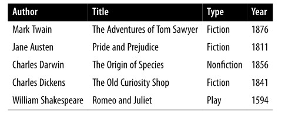
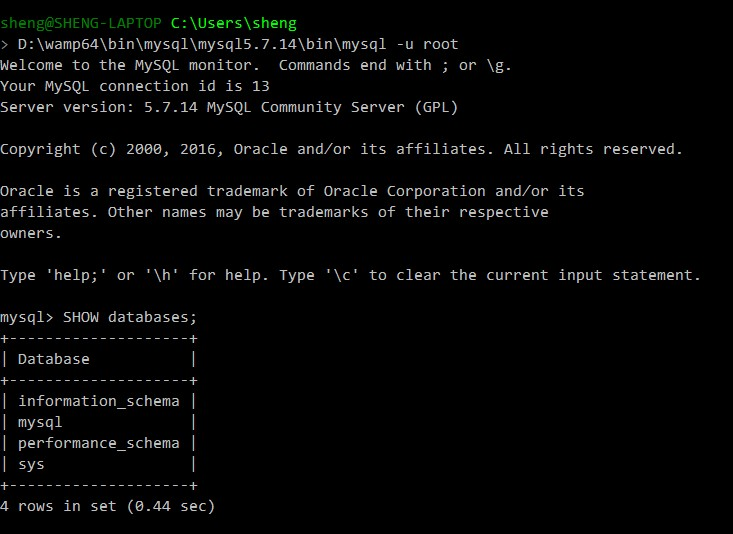

> 简单介绍MySQL基本概念
> 利用phpMyAdmin可以很好的学习MySQL

# 01 基本概念
A MySQL database contains one or more tables, each of which contains records or
rows. Within these rows are various columns or fields that contain the data itself.



Database: The overall container for a collection of MySQL data
Table: A subcontainer within a database that stores the actual data
Row: A single record within a table, which may contain several fields
Column: The name of a field within a row

There are three main ways in which you can interact with MySQL: 
1. using a comman line
2. via web interface such as phpMyadmin
3. through a programming language

## 1.1 通过命令行访问数据库
假设客户端使用的是wamp，默认账号为root，密码为空。
在windows命令行中键入以下命令，直接以root账户登陆MySQL: 

    D:\wamp64\bin\mysql\mysql5.7.14\bin\mysql -u root

在有密码的情况下使用下列命令登陆并键入密码:

    D:\wamp64\bin\mysql\mysql5.7.14\bin\mysql -u root -p



## 1.2 Using the Command-Line Interface

**The semicolon**
The semicolon is used by MySQL to separate or end commands.

**Canceling a command**
取消命令用`\c`, 避免使用`Control-C`

SQL commands and keywords are case-insensitive.  CREATE ,  create , and  CrEaTe
all mean the same thing. However, for the sake of clarity, the recommended style
is to use uppercase.

Table names are case-sensitive on Linux and OS X, but case-insensitive on Win‐
dows. So for portability purposes, you should always choose a case and stick to it.
The recommended style is to use lowercase for tables.

## 1.2 Common MySQL commands

	\c - Cancel input
	EXIT (CTRL-C) - Exit
	QUIT (\q) - Same as  EXIT
	HELP (\h, \?) - Display help
	STATUS (\s) - Display the current status
	DESC (DESCRIBLE) tablename;
	SHOW databases;
	SHOW tables;

# 02 基本操作

## 2.1 Creating a database
我们以创建一个publications数据库为例：

    CREATE DATABASE publications;

使用新创建的数据库：

    USE publications;

可以使用`\s`查看当前使用的数据库。

## 2.2 Creating a table
以创建的表名为classics为例。
```sql
CREATE TABLE classics (
	author VARCHAR(128),
	title VARCHAR(128),
	type VARCHAR(16),
	year CHAR(4)
) ENGINE MyISAM;
```
使用`DESCRIBE classics;`查看表的信息。

## 2.3 ALTER
ALTER命令可以做很多事情，但基本都和修改有关。

**添加字段**
	ALTER TABLE classics ADD id INT UNSIGNED NOT NULL AUTO_INCREMENT KEY;

上面的代码为classics表添加一个自增长的id.
INT UNSIGNED - 无符号整型
NOT NULL - 该字段不允许为空
AUTO_INCREMENT - 自增 1
KEY - 设为主键

**删除字段**

	ALTER TABLE classics DROP id; 

**修改表名**

	ALTER TABLE classics RENAME pre1900;

**Changing the data type of a column**

	ALTER TABLE classics MODIFY year SMALLINT;

**Adding a new column**

	ALTER TABLE classics ADD pages SMALLINT UNSIGNED;

**Renaming a column**

	ALTER TABLE classics CHANGE type category VARCHAR(16);

**Removing a column**

	ALTER TABLE classics DROP pages;

**Deleting a table**
```sql
CREATE TABLE disposable(trash INT);
DESCRIBE disposable;
DROP TABLE disposable;
SHOW tables;
```

## 2.4 Adding data to a table
Example. Populating the classics table
```sql
INSERT INTO classics(author, title, type, year)
VALUES('Mark Twain', 'The Adventures of Tom Sawyer', 'Fiction', '1876');
INSERT INTO classics(author, title, type, year)
VALUES('Jane Austen', 'Pride and Prejudice', 'Fiction', '1811');
INSERT INTO classics(author, title, type, year)
VALUES('Charles Darwin', 'The Origin of Species', 'Non-Fiction', '1856');
INSERT INTO classics(author, title, type, year)
VALUES('Charles Dickens', 'The Old Curiosity Shop', 'Fiction', '1841');
INSERT INTO classics(author, title, type, year)
VALUES('William Shakespeare', 'Romeo and Juliet', 'Play', '1594');
```
使用 `SELECT * FROM classics;`查看表的内容。

## 2.5 Creating the table classics with a primary key
```sql
CREATE TABLE classics (
	author VARCHAR(128),
	title VARCHAR(128),
	category VARCHAR(16),
	year SMALLINT,
	isbn CHAR(13),
	INDEX(author(20)),
	INDEX(title(20)),
	INDEX(category(4)),
	INDEX(year),
	PRIMARY KEY (isbn)
) ENGINE MyISAM;
```

# 03 Querying a MySQL Database

## 3.1 SELECT
Example:
```sql
SELECT * FROM tablename;
SELECT something FROM tablename;
SELECT author,title FROM classics;
SELECT title,isbn FROM classics;
```

**Counting rows**

	SELECT COUNT(*) FROM classics;

## 3.2 DELETE
删除某一行。

	DELETE FROM classics WHERE title='Little Dorrit';

## 3.3 UPDATE...SET
```sql
UPDATE classics SET author='Mark Twain (Samuel Langhorne Clemens)'
WHERE author='Mark Twain';
UPDATE classics SET category='Classic Fiction'
WHERE category='Fiction';
```

## 3.5 ORDER BY

	SELECT author,title FROM classics ORDER BY author ASC;
	SELECT author,title FROM classics ORDER BY title DESC;

As you can see, the first query returns the publications by author in ascending alpha‐
betical order (the default), and the second returns them by title in descending order.

# 04 简单测试
```sql
CREATE DATABASE school;
USE school;

CREATE TABLE student (
	id INT(10) UNSIGNED AUTO_INCREMENT NOT NULL,
	name VARCHAR(128),
	num VARCHAR(8),
	PRIMARY KEY (id)
) ENGINE MyISAM;


INSERT INTO student(id, name, num)
VALUES('5', 'sheng', '2014');
```


