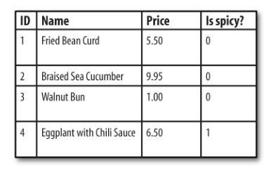

> PHP+MySQL教程BySheng

# 01 Orientation
PHP as a server-side language, meaning it runs on the web server (this is in
contrast to a client-side language such as JavaScript that is run inside of a web
browser)

## 1.1 What's So Great About PHP
1. PHP Is Free (as in Money)
2. PHP Is Free (as in Speech)
3. PHP Is Cross-Platform
4. PHP Is Widely Used
5. PHP Hides Its Complexity
6. PHP Is Built for Web Programming

## 1.2 Basic Rules of PHP Programs 

### Start and End Tags
The PHP source code inside each set of  `<?php ?>` tags is processed by the PHP engine,
and the rest of the page is printed as is.

### Whitespace and Case-Sensitivity
Whitespace is programmer-speak for blank-lookingcharacters such as spaces, tabs, and 
newlines.

Keywords and function names are case-insensitive(大小写不敏感)

### Comments
Single-line comments with // or # (modern style prefers  //)

Multiline comments ` /* */ `
 
# 02 Data: Working with Text and Numbers

## 2.1 Text

The biggest difference between single-quoted and double-quoted strings is that when
you include variable names inside a double-quoted string, the value of the variable
is substituted into the string, which doesn’t happen with single-quoted strings.

**Here document**
```php
print <<<HTMLBLOCK
<html>
<head><title>Menu</title></head>
<body bgcolor="#fffed9">
<h1>Dinner</h1>
<ul>
<li> Beef Chow-Fun
<li> Sauteed Pea Shoots
<li> Soy Sauce Noodles
</ul>
</body>
</html>
HTMLBLOCK
```

To combine two strings, use a  . (period).
Here are some combined strings:
```php
print 'bread' . 'fruit';
print "It's a beautiful day " . 'in the neighborhood.';
print "The price is: " . '$3.95';
print 'Inky' . 'Pinky' . 'Blinky' . 'Clyde';
```

## 2.2 Manipulating Text
The  `trim()` function removes whitespace from the beginning and end of a string.
The `strlen()` tells you the length of a string.
trim() and strlen() Example:
```php
if (strlen(trim($_POST['zipcode'])) != 5) {
    print "Please enter a zip code that is 5 characters long.";
}
```

To learn about other `printf()` format rules, visit http://www.php.net/sprintf.

**strtolower and strtoupper**
echo strtolower('Beef'); // display beef
echo strtoupper('Beef'); // display BEEF

The  `ucwords()` function uppercases the first letter of each word in a string.

**substr()**
substr - Return part of a string
string substr ( string $string , int $start [, int $length ] )
Returns the portion of string specified by the start and length parameters. 
```php
// 1. Truncating（缩短） a string with substr()
$psg = "The Fresh Fish with Rice Noodle was delicious, but I didn't like the Beef Tripe.";
substr($psg, 0, 30);
echo "..."; // Add an ellipsis
// Result: The Fresh Fish with Rice Noodl...

// 2. Extracting the end of a string with substr()
$num = "4000-1234-5678-9101";
echo substr($num, -4, 4); // display 9101
```

**str_replace()**
It looks for a substring and replaces the substring with a new string.
str_replace ($search, $replace, $subject);
```php
$str = "hello home";
$result = str_replace("home", "world", $str);
echo $result;  // display hello world
```

## 2.3 Numbers

## 2.4 Variables
Variable names are case-sensitive.

# 03 Logic: Making Decisions and Repeating Yourself

## 3.1 Understanding true and false
Every expression in a PHP program has a truth value:  true or  false . 

```php
// 这种写法可以避免少打一个等号，而造成错误
if (12 == $new_messages) {
    print "You have twelve new messages.";
}
```

## 3.2 Comparing floating-point numbers
浮点数不能直接比较。比如50.0在计算机中可能被存储为50.000000002.
因而我们采用一种做差的方式来比较两个浮点数的大小。
```php
if(abs($price_1 - $price_2) < 0.00001) {
    print '$price_1 and $price_2 are equal.';
} else {
    print '$price_1 and $price_2 are not equal.';
}
```

## 3.3 Repeating Yourself

# 04 Groups of Data: Working with Arrays
Scalar describes data that has a single value: a number, a piece of text,  true , 
or  false . Complex data types such as arrays, which hold multiple values, are not scalars.

## 4.1 Array Basics
```php
$vegetables = array(
    'corn' => 'yellow',
    'beet' => 'red',
    'carrot' => 'orange' );

$dinner = array(
    0 => 'Sweet Corn and Asparagus',
    1 => 'Lemon Chicken',
    2 => 'Braised Bamboo Fungus' );

$computers = array(
    'trs-80' => 'Radio Shack',
    2600 => 'Atari',
    'Adam' => 'Coleco' );
```

Using short array syntax to creat an array
` $vegetables = ['corn' => 'yellow', 'beet' => 'red', 'carrot' => 'orange']; `

Finding the size of an array
```php
$RedEyesDeck = ['Red-Eyes B. Dragon', 'Chick', 'The Sprit of Red-Eyes'];
echo count($RedEyesDeck);
```

## 4.2 Looping with foreach
```php
$meal = array(
    'breakfast' => 'Walnut Bun',
    'lunch' => 'Cashew Nuts and White Mushrooms',
    'snack' => 'Dried Mulberries',
    'dinner' => 'Eggplant with Chili Sauce' );

echo "<table border='1'>";
foreach ($meal as $key => $value) {
    echo "<tr><td>$key</td><td>$value</td></tr>";
}
echo '</table>';
```

## 4.3 Finding the value or the key
To check for an element with a certain key, use `array_key_exists()`
To check for an element with a particular value, use `in_array()` 
The  `array_search()` function is similar to `in_array()` , but if it finds an element,
it returns the element key instead of  true. 

## 4.4 Modifying Arrays
To remove an element from an array, use  `unset()`:
`unset($dishes['Roast Duck']);`

**implode and explode**
Making a string from an array with `implode()`
```php
$dimsum = array('Hello','World','20170618');
$menu = implode(', ', $dimsum);
echo $menu; // display Hello, World, 20170618
```

Printing HTML table rows with `implode()`.
```php
$dimsum = array('Chicken Bun','Stuffed Duck Web','Turnip Cake');
print '<tr><td>' . implode('</td><td>',$dimsum) . '</td></tr>';
```

The counterpart to implode() is called explode().
It breaks a string apart into an array. 
```php
$fish = 'Bass, Carp, Pike, Flounder';
$fish_list = explode(', ', $fish);
print "The second fish is $fish_list[1]";
```

## 4.5 Sorting Arrays
The `sort()` function sorts an array by its element values. 

To sort an associative array by element value, use `asort()`. 

To sort arrays by key with `ksort()`.

The array-sorting functions sort(), asort(), and ksort() have counterparts that
sort in descending order. The reverse-sorting functions are named `rsort()`,
`arsort()`, and `krsort()`.

# 05 Groups of Logic: Functions and Files  

## 5.1 Declaring and Calling Functions
```php
// Declaring
function sayHello() {
    echo "hello world 2017";
}
// Calling
sayHello();

function add($x, $y) {
    echo $x + $y;
}
add(5, 10);
echo "<br>";


function add2($x = 10, $y = 20) {
    echo $x + $y;
}
add2();

function payment_method($cash_on_hand, $amount) {
    if ($amount > $cash_on_hand) {
        return 'credit card';
    } else {
        return 'cash';
    }
}
```

## 5.2 Understanding Variable Scope

Variables defined outside of a function are called **global variables**. 
They exist in one scope. Variables defined inside of a function are 
called **local variables**. Each function has its own scope.

```php
$hel = "hello boy";

function f1() {
    echo $hel; // no outputs
}
```

**The $GLOBALS array**
```php
$hel = "hello man 2017";
function f2() {
    echo $GLOBALS['hel'];
}
f2();
```

**The global keyword**
```php
$dinner = 'Bread BaiShiCola';
function f3() {
    global $dinner;
    echo "$dinner";
    echo "<br>";
    $dinner = 'Meat LiangPin';
    echo $dinner;
    echo "<br>";
}

echo "$dinner";
echo "<br>";

f3();
echo "$dinner";
echo "<br>";
/* Outputs: 
Bread BaiShiCola
Bread BaiShiCola
Meat LiangPin
Meat LiangPin
*/
```

## 5.3 Running Code in Another File
Referencing a separate file
`require 'restaurant-functions.php';`

If the  require statement can’t find the file it’s told to load, or it does find
the file but it doesn’t contain valid PHP code, the PHP engine stops running your
program. The `include` statement also loads code from another file, but will keep 
going if there’s a problem with the loaded file.

# 06 Data and Logic Together: Working with Objects

Here are some basic terms to know when working with objects:
1. Class
2. Method
3. Property
4. Instance
5. Constructor
6. Static method - A special kind of method that can be called without instantiating a class.

## 6.1 Object Basics
```php
// Defining a class
class Entree {
    public $name;
    public $ingredients = array();
    public function hasIngredient($ingredient) {
        return in_array($ingredient, $this->ingredients);
    }
}

// Creating and using objects
$soup = new Entree;
$soup->name = 'Chicken Soup';
$soup->ingredients = array('chicken', 'water');

$sandwich = new Entree;
$sandwich->name = 'Chicken Sandwich';
$sandwich->ingredients = array('chicken', 'bread');

foreach (['chicken', 'lemon', 'bread', 'water'] as $ing) {
    if ($soup->hasIngredient($ing)) {
        print "Soup contains $ing.<br>";
    }
    if ($sandwich->hasIngredient($ing)) {
        print "Sandwich contains $ing.<br>";
    }
}

// Defining a static method
class Hello {
    public static function sayHello() {
        echo "hello world 61917";
    }
}
Hello::sayHello();
```

## 6.2 Constructors
A class can have a special method, called a constructor, which is run when the object
is created. 

```php
// Initializing an object with a constructor
class Entree {
    public $name;
    public $ingredients = array();
    public function __construct($name, $ingredients) {
        $this->name = $name;
        $this->ingredients = $ingredients;
    }
    public function hasIngredient($ingredient) {
        return in_array($ingredient, $this->ingredients);
    }
}

// Calling constructors
$soup = new Entree('Chicken Soup', array('chicken', 'water'));
$sandwich = new Entree('Chicken Sandwich', array('chicken', 'bread'));
```

# 07 Exchanging Information with Users: Making Web Forms
```php
// filename: hello.php
<!DOCTYPE html>
<html>
<head>
	<meta charset="utf-8">
	<title>PHP表单</title>
</head>
<body>
<form method="get" action="hello.php">
	<p><input type="text" name="my_name"></p>
	<p><input type="submit" value="提交"></p>
</form>
</body>
</html>

<?php
    echo $_GET["my_name"];
?>
```

## 7.1 Putting It All Together ( 144 )

# 08 使用PDO操作数据库
> 本章使用PHP Data Objects (PDO)来操作数据库。 

Information in your database is organized in tables, which have rows and columns.
(Columns are also sometimes referred to as fields.)



Almost all of the SQL queries that you write to use in your PHP programs will rely on
one of four SQL commands:  INSERT ,  UPDATE ,  DELETE , or  SELECT . 

## 8.1 Connecting to a Database Program
```php
// Connecting with a PDO object
 try {
     $db = new PDO('mysql:host=localhost;dbname=restaurant', 'root', '');
     echo "Connecting success!";
 } catch (PDOException $e) {
     echo "Couldn't connect to the database: " . $e->getMessage();
 }
```

## 8.2 创建表 插入数据
```php
try {
    
	$db = new PDO('mysql:host=localhost;dbname=restaurant', 'root', '');
    // 本地地址 数据库名称是：restaurant 账号root 密码为空

    // 创建表
	$sql = "CREATE TABLE dishes (
		dish_id INT,
		dish_name VARCHAR(255),
		price DECIMAL(4,2),
		is_spicy INT
	)";
    $q = $db->exec($sql);

    // 往表中插入数据
    $db->exec("INSERT INTO dishes (dish_name, price, is_spicy)
    VALUES ('Sesame Seed Puff', 2.50, 0)");

	
} catch (PDOException $e) {
	print "Couldn't create table: " . $e->getMessage();
}
```

## 8.3 PDO 错误处理
有三种错误处理模式：exception, silent, and warning. 

设置方法如下：
$db->setAttribute(PDO::ATTR_ERRMODE, PDO::ERRMODE_EXCEPTION);

# 09 使用mysqli操作数据库

> 这里只介绍mysqli过程化的方法。在面向对象阶段更多的使用PDO对象连接数据库。

## 9.1  用户注册
下面做一个简单的用户注册系统，来实际体验mysqli操作数据库的各个步骤。

**一、准备需要的测试数据**

在MySQL命令行中执行以下代码，生成需要的测试数据。
```sql
-- 创建库
CREATE DATABASE book;
USE book;

-- 创建表
CREATE TABLE `user` (
  `id` int(10) UNSIGNED NOT NULL,
  `username` varchar(30) NOT NULL,
  `password` char(32) NOT NULL,
  `createtime` int(11) NOT NULL
) ENGINE=MyISAM DEFAULT CHARSET=utf8;

-- 往表中插入数据
INSERT INTO `user` (`id`, `username`, `password`, `createtime`) VALUES
(NULL, 'sheng', '94c5ce', 1498570828),
(NULL, 'xx', '933c8c1', 1498570793),
(NULL, 'test', 'test', 1498619981),
(NULL, 'test', 'test', 1498620008),
(NULL, '李白', 'libai', 1498620041),
(NULL, '盲僧', '456', 1498620086);

-- 修改 id 为主键并设置为自增长
ALTER TABLE `user`
  ADD PRIMARY KEY (`id`);
ALTER TABLE `user`
  MODIFY `id` int(10) UNSIGNED NOT NULL AUTO_INCREMENT, AUTO_INCREMENT=8;
```

**二、HTML代码**

文件名： `reg.html`
```html
<!DOCTYPE html>
<html>
<head>
	<meta charset="utf-8">
	<title>用户注册</title>
</head>
<body>

<form action="connect.php" method="post">
	<p>用户名：<input type="text" name="username"></p>
	<p>密码：<input type="password" name="password"></p>
	<p>重复密码：<input type="password" name="repassword"></p>
	<p><input type="submit" value="提交"></p>
</form>

</body>
</html>
```

**三、添加到数据库**

文件名： connect.php
```php
<?php

if (trim($_POST['password']) != trim($_POST['repassword'])) {
	exit('两次密码不一致,请返回上一页');
}

$username = trim($_POST['username']);
$password = trim($_POST['password']);
$time = time();

$conn = mysqli_connect('localhost', 'root', '');
//如果有错误，存在错误号
if (mysqli_errno($conn)) {
	echo mysqli_error($conn);
	exit;
}

mysqli_select_db($conn, 'book');
mysqli_set_charset($conn, 'utf8');

$sql = "  INSERT INTO user(id, username, password, createtime) 
		  VALUES(NULL, '{$username}', '{$password}', '{$time}')  ";
$result = mysqli_query($conn, $sql);

if ($result) {
	echo '成功<br>';
} else {
	echo '失败<br>';
}

echo '当前用户插入的ID为' . mysqli_insert_id($conn);
mysqli_close($conn);
?>
```

**四、用户列表显示**
```php
<?php
$conn = mysqli_connect('localhost', 'root', '', 'book');

if (mysqli_errno($conn)) {
	mysqli_error($conn);
	exit;
}

mysqli_set_charset($conn, 'utf8');

$sql = " SELECT id, username, password, createtime FROM user ORDER BY id DESC ";
$result = mysqli_query($conn, $sql);

if ($result && mysqli_num_rows($result)) {
	echo "读取数据库中的数据，以表格的形式，循环遍历显示。<br><br>";
	echo '<table width="800" border="1">';
	echo '<tr> <th>id</th> <th>username</th> <th>password</th> <th>createtime</th> </tr>';

	while ($row = mysqli_fetch_assoc($result)) {
		$id = $row['id'];
		$username = $row['username'];
		$password = $row['password'];
		$createtime = date( 'Y-m-d H:i:s', $row['createtime'] );
		
		echo '<tr>';
		echo "<td>$id</td>";
		echo "<td>$username</td>";
		echo "<td>$password</td>";
		echo "<td>$createtime</td>";
		echo '</tr>';
	}
	
	echo '</table>';
} else {
	echo '没有数据';
}

mysqli_close($conn);
?>
```

## 9.2 一个完整的注册显示修改实例

> 实现的功能有：注册、列表显示、分页。

### 9.2.1 预备知识
**计算表数据总数**
```php
$conn = mysqli_connect('localhost', 'root', '', 'book');

$count_sql = 'SELECT count(id) AS c FROM user';
$result = mysqli_query($conn, $count_sql);
$data = mysqli_fetch_assoc($result);
$count = $data['c'];
echo $count;
```

**LIMIT**
语法：`SELECT * FROM tablename ORDER BY id DESC LIMIT offset, num;`
```sql
SELECT * FROM user ORDER BY id DESC LIMIT 5;
SELECT * FROM user ORDER BY id DESC LIMIT 0, 5;
-- 上面两种写法等价。倒序排序，显示前5个数据

SELECT * FROM user ORDER BY id DESC LIMIT 1, 5;
-- 倒序排序，从第2个开始显示，一共显示5个数据。
```

**完整代码**
```php
// filename: list.php
<?php

// 根据SQL语句，显示查询结果
function showLists($sql) {
	$conn = mysqli_connect('localhost', 'root', '', 'book');
	if (mysqli_errno($conn)) {
		mysqli_error($conn);
		exit;
	}
	mysqli_set_charset($conn, 'utf8');
	
	$result = mysqli_query($conn, $sql);

	if ($result && mysqli_num_rows($result)) {
		echo '<table width="800" border="1">';
		echo '<tr> <th>id</th> <th>username</th> <th>password</th> 
				<th>createtime</th> <th>操作1</th> <th>操作2</th> </tr>';

		while ($row = mysqli_fetch_assoc($result)) {
			$id = $row['id'];
			$username = $row['username'];
			$password = $row['password'];
			$createtime = date( 'Y-m-d H:i:s', $row['createtime'] );
			
			echo '<tr>';
			echo "<td>$id</td>";
			echo "<td>$username</td>";
			echo "<td>$password</td>";
			echo "<td>$createtime</td>";

			//echo '<td><a href="edit.php?id=' . $row['id'] . '">编辑用户</a></td>';
			//echo '<td><a href="delete.php?id=' . $row['id'] . '">删除用户</a></td>';
			echo '</tr>';
		}
		
		echo '</table>';
	} else {
		echo '没有数据';
	}

	mysqli_close($conn);
}

// 得到数据总数
function getTotalRecords($tablename = "user") {
	$conn = mysqli_connect('localhost', 'root', '', 'book');
	if (mysqli_errno($conn)) {
		mysqli_error($conn);
		exit;
	}
	mysqli_set_charset($conn, 'utf8');

	$sql = "select count(id) as c from $tablename";
	$result = mysqli_query($conn, $sql);
	$data = mysqli_fetch_assoc($result);
	$count = $data['c'];

	mysqli_close($conn);
	return $count;
}

/*
	函数功能：以分页的方式显示用户数据列表
	参数说明：$page_item, 每页显示的记录。 默认每页显示5项。
		     $tablename, 要分页显示的表名称。默认是user表。
*/
function showPageList($page_item = 5, $tablename = "user") {
	$page = isset($_GET['page']) ? (int) $_GET['page'] : 1; // 当前页
	$total = ceil(getTotalRecords() / $page_item); // 得到总页数
	if ($page <= 1) $page = 1;
	if ($page >= $total) $page = $total;

	$offset = ($page - 1) * $page_item;
	$sql = " SELECT id, username, password, createtime 
			 FROM $tablename ORDER BY id DESC LIMIT $offset, $page_item ";

	showLists($sql);

	echo "<a href='list.php?page=1'>首页</a> | ";
	echo "<a href='list.php?page=" . ($page - 1) . "'>上一页</a> | ";
	echo "<a href='list.php?page=" . ($page + 1) . "'>下一页</a> | ";
	echo "<a href='list.php?page={$total}'>尾页</a> &nbsp;&nbsp;&nbsp;&nbsp;&nbsp;&nbsp;";
	echo "[ $page / $total ]";
}

showPageList(); 

// 显示全部数据
// showLists("SELECT * FROM user");
```


# 待分类

## null合拢运算符
` echo $x ?? "hello world"; ` 
这里的意思是指如果$x为空，则输出"hello world"
http://www.myexception.cn/php/2055689.html

## PHP获取和设置时区
获取时区 `date_default_timezone_get ()`
设置时区 `date_default_timezone_set('Asia/shanghai')`
```php
echo date_default_timezone_get ();
// 获取时区，默认情况下输出 UTC 代表世界时

date_default_timezone_set('Asia/shanghai');
echo date_default_timezone_get ();
// 输出 'Asia/shanghai'， 代表已经把时间设置成了北京时间

echo date('Y-m-d H:i:s', time());
```


# 参考资源
1. http://php.net/
2. http://www.oreilly.com/web-platform/free/upgrading-to-php-seven.csp
3. http://laravel-china.github.io/php-the-right-way/

