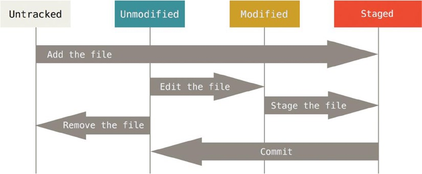

# 准备开始
git 最新版本为2.13.3 （2017071）
git --version 查看当前git版本
切换到工作目录 `cd /d/Asheng_IDE/Go_Git`

## About Git
offical site: https://git-scm.com/

## Installing Git on Windows
1. https://git-for-windows.github.io/
2. https://git-scm.com/download/win
3. http://windows.github.com

## First-Time Git Setup
Git中的配置分三种层级：全用户、当前用户、当前项目。
对应的命令分别如下：

    git config --system
    git config --global
    git config

初次安装使用Git需要设置的配置文件如下：
**设置个人信息**
    
    git config --global user.name "Asheng"
    git config --global user.email xys4k@qq.com

重复设置即为修改。最后的设置信息去掉，即为读取当前设置。

**设置默认编辑器**
设置winodws下git默认编辑器方法如下。
git config --global core.editor  "'C:/Program Files/Notepad++/notepad++.exe' -multiInst -notabbar -nosession -noPlugin"

**设置取消自动转换换行符**
http://blog.jobbole.com/46200/

    git config --global core.autocrlf false

## 读取Git配置信息
git config --list （列出所有配置信息）
git config --list --global
git config --list --system
git config user.name

## 查看帮助
三种查看帮助方法。

    git help <verb>
    git <verb> --help
    man git-<verb>  

For example:
    
    git help config

# Git Basics

## Getting a Git Repository
可以把一个空文件夹初始化为Git仓库，也可以克隆一个已经存在的Git仓库。

If you’re starting to track an existing project in Git, you need to go to the project’s directory and type

    git init

This creates a new subdirectory named .git that contains all your necessary repository files—a Git repository
skeleton. 

**Cloning an Existing Repository**

    git clone https://github.com/libgit2/libgit2

That creates a directory named libgit2, initializes a .git directory inside it.

    git clone https://github.com/libgit2/libgit2 mylibgit

That command does the same thing as the previous one, but the target directory is called mylibgit.

## Recording Changes to the Repository
The lifecycle of the status of your files.


### Checking the Status of Your Files

    echo 'My Project' > README
    git status
    git status -s （查看简化版的状态）

运行上述命令将能看到README文件未被Git追踪。

### Tracking New Files

    git add filename
    git add directory
    git status

### Staging Modified Files
It may be helpful to think of `git add` more as “add this content to the next commit”
rather than “add this file to the project”.

**举例说明一个文件在Git中的各种状态**
有一个git目录名为test，直接在该目录新建文件`720.txt`，则该文件的状态为`Untracked files`。
然后执行`git add 720.txt`，则该文件的状态变为`Changes to be committed:`。
再执行`git commit 720.txt`，则该文件已被提交完毕。
再执行`notepad 720.txt`，对该文件进行任意的编辑，则文件的状态为`Changes not staged for commit:`。
再执行`git add 720.txt`，则该文件的状态变为`Changes to be committed:`。
如果此时再执行`notepad 720.txt`，则该文件同时有两个状态`Changes to be committed:`和
`Changes not staged for commit:`。

### 忽略文件
```
Here is another example .gitignore file:
# a comment - this is ignored
*.a # no .a files
!lib.a # but do track lib.a, even though you're ignoring .a files above
/TODO # only ignore the root TODO file, not subdir/TODO
build/ # ignore all files in the build/ directory
doc/*.txt # ignore doc/notes.txt, but not doc/server/arch.txt
跟多忽略规则参考： https://github.com/github/gitignore
```

### Viewing Your Staged and Unstaged Changes
To see what you’ve changed but not yet staged, type `git diff` with no other arguments.

If you want to see what you’ve staged that will go into your next commit, 
you can use `git diff --staged`. This command compares your staged changes to your last commit.

### Committing Your Changes
git commit 把stage area中的文件全部提交。

### Skipping the Staging Area
git commit -a -m 'added new benchmarks'
直接把所有已经追踪的文件提交版本。

## Viewing the Commit History
git log
git log --pretty=oneline (简化显示)

## Working with Remotes
查看当前已经连接到的远程仓库，如果该仓库本身就是克隆自远程仓库，则Git会自动连接到该仓库。
origin是远程仓库的默认简短名称。
git remote
git remote -v

**添加远程仓库**
git remote add pb https://github.com/paulboone/ticgit (pb既是该仓库在git中的简短名称)
git remote -v

### Fetching and Pulling from Your Remotes
get data from your remote projects, you can run:
    
    git fetch [remote-name]
    git fetch origin

### Pushing to Your Remotes
When you have your project at a point that you want to share, you have to push it upstream.

    git push [remote-name] [branch-name]
    git push origin master (push your master branch to your origin server)

### Inspecting a Remote
git remote show origin


