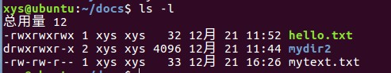

## Linux版本
Linux系统是一个多用户、多任务的分时操作系统。
Linux版本分为内核版本和发行版本。
常见的Linux发行版有：
1. RedHat(分为用于企业的Red Hat Enterprise Linux和面向个人的免费版本Fedora)。 
2. CentOS。基于Red Hat Enterprise Linux
3. Debian。可以认为是最正宗的Linux，与其他Linux发行版不同，其背后没有任何公司或组织支持，纯粹由世界各地的自愿者组成。
4. Ubuntu。基于Debian,界面支持不叫友好。 

## Linux目录结构
路径分为绝对路径和相对路径。
`cd /` 进入根目录
`cd /home` 进入用户目录
`.` 表示当前目录
`..` 表示上一层目录
与Windows不同Linux严格区分大小写，并且不能根据文件的扩展名判断文件的类型。

## Linux常用命令
### 目录操作基本命令
`ls filename`列出当前目录或所选目录所有内容，加参数`ls -l`列出详细内容。参数`*`可以显示以指定名称
开头的文件。
`cd /`切换到根目录。
`pwd` 显示当前所在目录。
`mkdir dirname` 创建目录。
`rmdir dirname` 删除空目录。
`rm -r dirname` 强制删除给定目录及其子目录，不管目录是否为空。

### 文件操作基本命令
`touch filename` 创建文件。 
`rm dirname or filename` 删除目录或文件。添加参数`-r`强制删除，不管目录是否为空。
`cat >filename` 在命令行中制作新文件，制作结束后，`Ctrl+D`退出新文件制作。
`cat >>filename` 追加文件的内容。
`cat filename` 在命令行中显示该文件的内容。
`cp 源文件 目标目录` 复制文件。
`mv 源文件 目标目录` 移动文件。

### 文件权限和属性修改
`chmod a=rwx filename` 为所有用户增加(原来的权限自动取消)读写执行权限。
文件使用者有4中类型，u、g、o、a。分别表示user、group、others、all。
操作符包括三种类型，+、-、=，分别表示增加权限，删除权限、赋予给定的权限。
权限类型包括三种基本类型: r、w、x。
**数字化文件权限表示**。4表示r，2表示写，1表示执行，0表示-(没有权限)
举例说明：
	chmod a=rwx filename 相当于 chmod 777 filename
	chmod ug=rwx,o=- filename 相当于 chmod 770 filename

### 目录或文件权限详细信息说明
Linux中每个文件或者目录都有对应的权限，都有其所属的用户及用户组。
使用`ls -l`可以查看当前目录下文件的详细信息截图如下：

假设我们把第一行从左到右按照空格分为7个部分。下面分别介绍每个部分的含义。
第1部分"-rwxrwxrwx":这一部分共有10个字符组成，第一个字符右三种清空："-"代表普通文件，d代表目录，
l代表链接文件，b代表设备文件。后面9个字符每3个字符为一组工分为三组，
分别代表user(用户)、group(用户组)、others(其他人)对该目录或文件的权限。
每组3个字符分别代表读、写、执行的权限，没有该权限则用"-"表示。执行权限有连个字符可选x代表可执行，s代表套接口文件。
第2部分表示当前目录下的目录文件数目。
第3部分和第4部分分别表示，该问文件或目录所属于的user和group。
第5部分表示文件的大小。
第6部分表示修改时间。
第7部分代表目录或文件的名字。

## 压缩与解压缩基本命令
Linux上压缩文件格式一般用两种`.zip`和`.tar.gz`前者可跨三平台使用，后者压缩率较高。
打包和压缩的区别：打包是把多个目录或文件打包成一个文件，但不压缩即文件大小不变。
（本文不严格区分打包和压缩）
### zip格式压缩与解压
压缩：` zip -r filename.zip directory` 把指定目录里所有的子目录和文件打包成filename.zip文件并
放在当前目录下。
解压：`unzip filename.zip` 将压缩文件在当前目录解压

### tar.gz格式压缩与解压
压缩：`tar -zcvf archive_name.tar.gz directory_to_compress` 打包后，以 gzip 压缩
解压：` tar -zxvf archive_name.tar.gz` 解压到当前目录
参考链接: 
	http://man.linuxde.net/tar
	http://blog.chinaunix.net/uid-24250828-id-2621420.html

## 磁盘操作命令
此部分内容，在实际操作中，个人感觉对新手不重要。以后扩充。

## 关机重启命令
`poweroff` 关机
`reboot` 重启

## 内置帮助命令
`man pwd` 显示pwd用法
`help pwd` 显示pwd详细用法
有些命令直接输入该命令不加任何参数可以查看简要帮助。比如`apt-get`
大多数命令输入`命令 --help`也可以查看帮助
## 时间相关命令
`cal` 显示月历
`cal -y` 显示年历
`date` 显示当前时间
## Ubuntu Linux文件及目录不同颜色所代表的含义
1. 黑色(默认) 普通文件
2. 蓝色 目录
3. 绿色 可执行文件
4. 红色 压缩文件
5. 水红色 图像文件
6. 青色 链接文件(相当于快捷方式)
7. 黄色 设备文件

## Linux命令行编辑器
### vi/vim
`vi` 启动vi编辑器
`:q` 退出编辑器(不保存)
`:wq` 保存并退出
vi或者vim是命令文本编辑器的典范，不用鼠标就可以实现非常高级的文本编辑操作。
但是上手难度太大，尤其是对于已经非常熟悉Windows系统操作的用户来说，总是感觉
vi编辑的操作设定简直就是反人类。
如果有一天我的工作是远程维护各种大型服务器，再考虑深入学习vi。
暂时略过。

### nano
超简单命令行编辑器，比vim简单很多。
`nano filename` 编辑文件

## Ubuntu软件安装与卸载(基于Debian Linux)
使用`apt-get`命令。
详细内容参考：
http://www.cnblogs.com/pswzone/archive/2012/04/09/2438885.html

## 系统资源查看命令
`ps` 显示当前正在运行的进程，加参数`-e` 显示所有进程
`free` 查看系统内存使用情况，加参数`-m`则以M为单位查看
`df` 查看系统磁盘使用情况，加参数`-h`结果人性化显示

## 用户管理
### Linux用户简介
在Linux中，用户一般可分为3类：超级用户(root)、管理员用户、普通用户。
Linux按一定的原则把用户分为用户组。一个组里可以有很多用户，一个用户也可以属于多个组。
普通用户要想执行'高级命令'可以在具体的命令前冠以sudo命令。
Linux系统保存用户的文件信息在`/etc/passwd`和`/etc/shadow`，保存用户组的系统文件在`/etc/group`。
这些文件都可以在命令行中使用`cat`命令，查看。
关于Linux系统中增加、修改、删除用户或用户组一般有两种方法图形界面和命令行修改。

### 普通用户与root用户切换
`whoami` 检测自己是谁
`sudo 命令` 以管理员身份执行次命令
`su username` 切换用户(root切换到其它用户不需要密码，否则则需要相应用户的密码)
在Ubuntu Linux中，要想实现切换到root，现需要激活root。没有被激活的root没有密码，激活可以认为
就是为root添加密码。
在Ubuntu下，并且处于**普通用户下**激活与锁定root用户的命令如下：
    `sudo passwd root` 接下来连续输入两次想要设置root密码即可
    `sudo passwd -l root` 锁定root用户，并且清楚原先root用户的密码，此时已经不能再使用su切换到
root用户了。

## Linux常用网络命令
`ifconfig` 查看ip地址
`ping -c5 baidu.com` 测试网络是否畅通参数`-c5`使用来控制执行的次数，也可使用`Ctrl+C`停止执行。

## Shell简单了解
一个简单的Shell脚本及其执行方法如下。

	#! /bin/bash
	echo "这是一个Shell脚本" # 输出文本内容
	echo "This is a Shell Script."
	date # 打印系统时间
	# 文件名：myshell
	# 第一句代码使用bash来解释执行。
	# Shell脚本没有限定的扩展名，一般也无需扩展名。
	# 使用 bash filename 即可执行该shell script。
	# . filename 和 soucrce filename 也可以执行shell script。
	# 文件名：myshell
	# 第一句代码使用bash来解释执行。
	# Shell脚本没有限定的扩展名，一般也无需扩展名。
	# 使用 bash filename 即可执行该shell script。
	# . filename 和 soucrce filename 也可以执行shell script。

## Ubuntu软件包管理
### 软件包简介
`dpkg` dpkg命令是Debian Linux系统用来安装、创建和管理软件包的实用工具。
详见：http://man.linuxde.net/dpkg
Ubuntu使用的包管理工具是APT(the Advanced Packaging Tool)。
Ubuntu也支持Red Hat格式的软件包即RPM格式，还支持Tarball格式的软件包即tar.gz或者tar.bz2。
APT常用的三个命令apt-get、apt-cache。
推荐安装**新立得软件包管理器(synaptic)** 安装命令为`apt-get install synaptic`
该软件的使用是先标记以便安装(或卸载)再点击应用。
### 配置软件源
此步骤非常重要，一般来说新装的Linux系统软件源默认都是国外服务器的软件仓库，更新或者下载软件的速度
惨不忍睹。修改软件源一般有两种方法：
1. 直接修改配置文件
   Ubuntu Linux软件源的详细信息在`/etc/apt/sources.list`。使用gedit打开此文件，删除原来的所有内容，改成以下内容(Ubuntu中国官方镜像)

   	deb http://cn.archive.ubuntu.com/ubuntu/ xenial main restricted
   	deb http://cn.archive.ubuntu.com/ubuntu/ xenial-updates main restricted
   	deb http://cn.archive.ubuntu.com/ubuntu/ xenial universe
   	deb http://cn.archive.ubuntu.com/ubuntu/ xenial-updates universe
   	deb http://cn.archive.ubuntu.com/ubuntu/ xenial multiverse
   	deb http://cn.archive.ubuntu.com/ubuntu/ xenial-updates multiverse
   	deb http://cn.archive.ubuntu.com/ubuntu/ xenial-backports main restricted universe multiverse
   	deb http://cn.archive.ubuntu.com/ubuntu/ xenial-security main restricted
   	deb http://cn.archive.ubuntu.com/ubuntu/ xenial-security universe
   	deb http://cn.archive.ubuntu.com/ubuntu/ xenial-security multiverse

或者是如下内容(东北大学镜像)

		deb http://mirror.neu.edu.cn/ubuntu/ xenial main restricted
		deb http://mirror.neu.edu.cn/ubuntu/ xenial-updates main restricted
		deb http://mirror.neu.edu.cn/ubuntu/ xenial universe
		deb http://mirror.neu.edu.cn/ubuntu/ xenial-updates universe
		deb http://mirror.neu.edu.cn/ubuntu/ xenial multiverse
		deb http://mirror.neu.edu.cn/ubuntu/ xenial-updates multiverse
		deb http://mirror.neu.edu.cn/ubuntu/ xenial-backports main restricted universe multiverse
		deb http://mirror.neu.edu.cn/ubuntu/ xenial-security main restricted
		deb http://mirror.neu.edu.cn/ubuntu/ xenial-security universe
		deb http://mirror.neu.edu.cn/ubuntu/ xenial-security multiverse

2. 在`软件和更新`中设置选择中国服务器或者最佳服务器。

## 未分类
1. `clear` 清空命令行界面
2. `gedit filename` 调用gedit程序编辑该文件。
3. linux命令查询网站：man.linuxde.net
4. `Ctrl + C` 终止当前命令的输入，取消当前的操作 
5. `Shift + PgUp` 在命令行中实现向上翻页
6. **自动补全**输入命令或文件名的一部分，按`Tab`键可实现自动补全，连续按2次`Tab`键可列出所有相关命令。
7. Linux Markdown http://pad.haroopress.com/user.html 需翻墙
8. `alias` 查看命令别名
9. `history 5` 列出最近使用的5条命令
10. 编程语言一般可分为两大类：
   	编译性语言。代码需要先编译，生产可执行文件才能执行。
   	脚本语言。代码无需事先编译，直接就可以执行，但速度相对较慢。
11. `exit` 退出当前终端

## 写在最后
这份笔记与2016年12月22日 晚上写成。
使用的环境是：[VMware Workstation 12 Player](http://www.vmware.com/cn.html) + [Ubuntu Kylin 16.04 LTS](http://www.ubuntukylin.com/)。
参考书籍：王宏勇，马宏琳，阎磊.Ubuntu Linux基础教程.北京：清华大学出版社，2015.

